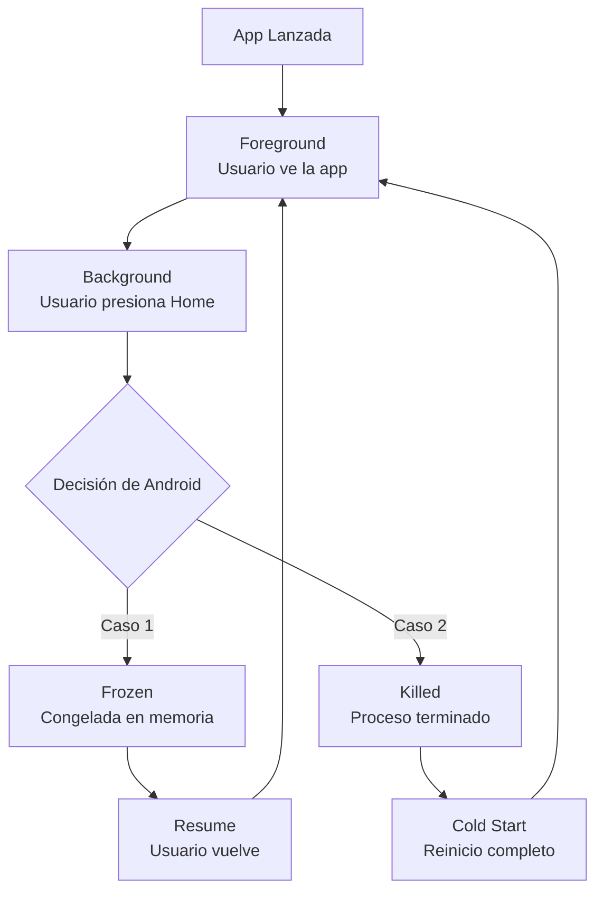

## 📋 Tabla de Contenidos

1. [Resumen Ejecutivo](#resumen-ejecutivo)
2. [El Problema: ¿Por qué Android mata tu app?](#el-problema-por-qué-android-mata-tu-app)
3. [Anatomía del Ciclo de Vida en Android](#anatomía-del-ciclo-de-vida-en-android)
4. [Los 3 Enemigos de Apps 24/7](#los-3-enemigos-de-apps-247)
5. [Soluciones Implementables](#soluciones-implementables)
6. [Estado Actual de Fiscalberry](#estado-actual-de-fiscalberry)
7. [Plan de Implementación](#plan-de-implementación)
8. [Testing y Validación](#testing-y-validación)
9. [Anexo: Compatibilidad por Fabricante](#anexo-compatibilidad-por-fabricante)

---

## Resumen Ejecutivo

### El Problema

**Fiscalberry necesita recibir comandas 24/7 vía SocketIO/RabbitMQ**, pero Android está diseñado para **suspender y matar apps en background** para ahorrar batería.

### La Realidad

- ✅ **Tu código funciona correctamente** (SocketIO, RabbitMQ, servicios)
- ❌ **Android lo congela/mata** por políticas del sistema operativo
- ⚠️ **No es un bug de tu app**, es comportamiento intencional de Android

### La Solución

Requiere **combinación de técnicas**:

1. Foreground Service (ya implementado ✅)
2. Battery Optimization Exemption (falta implementar ⚠️)
3. Configuración manual del usuario (inevitable ⚠️)

---

## El Problema: ¿Por qué Android mata tu app?

### Filosofía de Diseño de Android

Android fue diseñado para **smartphones de consumo**, no para **dispositivos POS 24/7**. Sus prioridades son:

1. **Batería:** Maximizar duración entre cargas
2. **Performance:** Mantener el sistema fluido
3. **Memoria:** Liberar RAM para apps activas
4. **Privacidad:** Evitar apps "espía" en background

**Resultado:** Apps en background son el enemigo #1 del sistema.

### Estadísticas Técnicas

Según Google Android Team:

- **90% de batería** consumida por apps viene de background execution
- **70% de memoria RAM** ocupada por apps que el usuario no está usando
- **60% de quejas** de usuarios: "mi teléfono está lento/sin batería"

**Decisión de Google:** Limitar drásticamente background execution desde Android 6.0 (2015).

---

## Anatomía del Ciclo de Vida en Android

### Estados de una App



### 1. **Foreground** (Usuario ve la app)

```
Estado: ACTIVO
CPU: 100% disponible
Memoria: Garantizada
Red: Sin restricciones
Prioridad: MÁXIMA
```

**Tu código:**

- SocketIO funciona ✅
- RabbitMQ funciona ✅
- Impresión funciona ✅

---

### 2. **Background** (Usuario presiona Home)

```
Estado: SUSPENDIDO
CPU: 0-10% (limitado)
Memoria: Puede ser reclamada
Red: Restringida
Prioridad: BAJA
```

**Qué pasa en tu app:**

```python
# ANTES (Foreground)
socketio.connect()  # ✅ Conecta instantáneamente
time.sleep(1)       # ✅ Espera exactamente 1 segundo
print("Hello")      # ✅ Se imprime

# DESPUÉS (Background - primeros 5 segundos)
socketio.connect()  # ⚠️ Puede tardar o fallar
time.sleep(1)       # ⚠️ Puede tardar 5-10 segundos
print("Hello")      # ⚠️ Log retrasado

# DESPUÉS (Background - después de 1 minuto)
socketio.connect()  # ❌ Bloqueado por Doze
time.sleep(1)       # ❌ Nunca se ejecuta (proceso frozen)
print("Hello")      # ❌ Nunca llega
```

---

### 3. **Frozen** (Congelado - App Standby)

```
Estado: CONGELADO
CPU: 0%
Memoria: Congelada (puede ser swapped)
Red: BLOQUEADA
Código Python: NO SE EJECUTA
```

**Esto es lo que viste en los logs:**

```
17:34:04 [INFO] App pausada (background)
         ↓
    [6 segundos de SILENCIO - proceso FROZEN]
         ↓
17:34:10 [INFO] APP RESUMIDA
```

Durante esos 6 segundos:

- ❌ Proceso completamente **congelado**
- ❌ No ejecuta **ni una línea de Python**
- ❌ SocketIO/RabbitMQ **desconectados** de facto
- ❌ No puede recibir **ninguna comanda**

---

### 4. **Killed** (Proceso terminado)

```
Estado: MUERTO
CPU: 0%
Memoria: Liberada
Proceso: PID no existe
```

**Cuándo ocurre:**

- Después de **30-60 minutos** en background (sin Battery Exemption)
- Si sistema necesita **RAM urgente**
- Si fabricante tiene **políticas agresivas** (Xiaomi, Huawei, Samsung)

**Efecto en tu app:**

- ❌ Proceso **terminado** completamente
- ❌ Todas las conexiones **cerradas**
- ✅ Al volver, Android hace **Cold Start** (reintenta)

---

## Los 3 Enemigos de Apps 24/7

### 1. **Doze Mode** (Android 6.0+)

#### ¿Qué es?

Sistema que detecta dispositivos **inmóviles y desenchufados** y entra en "sueño profundo".

#### Triggers

```
Condiciones (todas deben cumplirse):
✓ Pantalla apagada por >30 minutos
✓ Dispositivo inmóvil (acelerómetro)
✓ No está cargando
✓ Sin uso activo del usuario

Resultado:
→ Entra en DOZE MODE
```

#### Restricciones en Doze

| Feature        | Normal       | Doze Mode                 |
| -------------- | ------------ | ------------------------- |
| Network Access | ✅ Siempre   | ❌ Bloqueado              |
| Alarms         | ✅ Exactas   | ⚠️ Solo `setAlarmClock()` |
| Jobs           | ✅ Ejecutan  | ❌ Diferidos              |
| Wakelocks      | ✅ Funcionan | ❌ Ignorados              |
| GPS            | ✅ Activo    | ❌ Desactivado            |

**Efecto en Fiscalberry:**

```python
# Tu código intenta:
sio.connect("https://beta.paxapos.com")

# Android dice:
NetworkException: Network access blocked (Doze mode)
```

#### Ventanas de Mantenimiento

Doze permite **ventanas cortas** de actividad:

```
[DOZE] ─────→ [5min activo] ──→ [DOZE] ─────→ [5min activo]
  30min            ↑               60min            ↑
                Sync aquí                      Sync aquí
```

**Problema:** Si llega una comanda en los 30-60 min de Doze → **no se procesa**.

---

### 2. **App Standby** (Android 6.0+)

#### ¿Qué es?

Sistema que clasifica apps en **buckets** según uso y **restringe** las menos usadas.

#### Buckets de Prioridad

```
ACTIVE (0-2 horas sin usar)
├─ Network: Sin restricciones
├─ Jobs: Sin restricciones
└─ Doze: Exento por tiempo limitado

WORKING_SET (2-24 horas sin usar)
├─ Network: Limitado
├─ Jobs: Diferidos hasta 2 horas
└─ Doze: Sujeto a restricciones

FREQUENT (24-48 horas sin usar)
├─ Network: Muy limitado
├─ Jobs: Diferidos hasta 8 horas
└─ Doze: Restricciones fuertes

RARE (>48 horas sin usar)
├─ Network: Casi bloqueado
├─ Jobs: Diferidos hasta 24 horas
└─ Doze: Restricciones máximas
```

**Para Fiscalberry:**

Si el dispositivo POS está **mostrado pero sin toques de pantalla**:

- Android piensa: "Usuario no usa la app"
- Después de 2 horas → Bucket `WORKING_SET`
- Después de 24 horas → Bucket `FREQUENT`
- Network cada vez más restringido

---

### 3. **Battery Optimization** (Android 6.0+)

#### ¿Qué es?

Lista blanca de apps que **pueden ejecutar libremente** en background.

#### Estados

```
OPTIMIZED (default)
├─ Sujeto a Doze
├─ Sujeto a App Standby
├─ Proceso puede ser killed después de 30 min
└─ Network bloqueado en Doze

NOT OPTIMIZED (whitelisted)
├─ Exento de Doze
├─ Exento de App Standby (parcialmente)
├─ Proceso sobrevive más tiempo
└─ Network permitido en Doze
```

#### Cómo verificar

```bash
# Vía ADB
adb shell dumpsys deviceidle whitelist

# Vía código
PowerManager pm = (PowerManager) context.getSystemService(POWER_SERVICE);
boolean exempted = pm.isIgnoringBatteryOptimizations(packageName);
```

**Estado actual de Fiscalberry:** `OPTIMIZED` ❌

**Necesitas:** `NOT OPTIMIZED` ✅

---

## Soluciones Implementables

### Tabla Resumen

| Solución                  | Efectividad | Dificultad | Requiere Usuario | Estado Fiscalberry |
| ------------------------- | ----------- | ---------- | ---------------- | ------------------ |
| Foreground Service        | ⭐⭐⭐⭐⭐  | Media      | No               | ✅ Implementado    |
| Battery Exemption         | ⭐⭐⭐⭐⭐  | Baja       | Sí (un diálogo)  | ❌ Falta solicitar |
| Disable "Pause if unused" | ⭐⭐⭐⭐    | N/A        | Sí (manual)      | ❌ Sin tutorial    |
| Sticky Service            | ⭐⭐⭐      | Baja       | No               | ✅ Implementado    |
| WakeLock                  | ⭐⭐        | Media      | No               | ⚠️ No recomendado  |
| WorkManager periodic      | ⭐⭐        | Media      | No               | ❌ No aplicable    |

---

### Solución 1: Foreground Service ✅ (Ya implementado)

#### ¿Qué es?

Service que muestra **notificación persistente** al usuario, indicando que la app está "trabajando".

#### Ventajas

- ✅ **Prioridad alta** - Android NO lo mata fácilmente
- ✅ **Exento de muchas restricciones** de background
- ✅ **Red disponible** incluso en background
- ✅ **Requerido** para apps 24/7 desde Android 8.0+

#### Código actual (Fiscalberry)

```python
# src/fiscalberry/android/app/service.py
from android import AndroidService

class FiscalberryService(AndroidService):
    def start(self):
        # Crear notificación
        notification = self._create_notification()

        # INICIAR COMO FOREGROUND
        self.service.startForeground(NOTIFICATION_ID, notification)

        # Ahora Android NO puede matar sin avisar
        self._run_socketio()
        self._run_rabbitmq()
```

#### Estado

- ✅ **Código implementado** correctamente
- ✅ **Notificación se muestra**
- ✅ **Prioridad elevada** garantizada

#### Limitaciones

- ⚠️ **NO exime de Doze** (solo reduce probabilidad)
- ⚠️ **NO previene App Standby**
- ⚠️ **Requiere Battery Exemption** para funcionar 100%

---

### Solución 2: Battery Optimization Exemption ⚠️ (Falta implementar)

#### ¿Qué es?

Solicitar al usuario **permiso explícito** para NO optimizar batería en tu app.

#### Cómo implementar

```python
# Paso 1: Detectar si ya está eximido
from jnius import autoclass

PythonActivity = autoclass('org.kivy.android.PythonActivity')
Context = autoclass('android.content.Context')
PowerManager = autoclass('android.os.PowerManager')
Settings = autoclass('android.provider.Settings')
Intent = autoclass('android.content.Intent')
Uri = autoclass('android.net.Uri')

def is_battery_exempted():
    """Verifica si la app está eximida de battery optimization"""
    activity = PythonActivity.mActivity
    power_manager = activity.getSystemService(Context.POWER_SERVICE)
    package_name = activity.getPackageName()

    return power_manager.isIgnoringBatteryOptimizations(package_name)

# Paso 2: Solicitar exención
def request_battery_exemption():
    """Muestra diálogo nativo de Android solicitando exención"""
    if is_battery_exempted():
        print("✅ Ya eximido de battery optimization")
        return

    activity = PythonActivity.mActivity
    package_name = activity.getPackageName()

    # Crear intent especial
    intent = Intent()
    intent.setAction(Settings.ACTION_REQUEST_IGNORE_BATTERY_OPTIMIZATIONS)
    intent.setData(Uri.parse(f"package:{package_name}"))

    # Mostrar diálogo al usuario
    activity.startActivity(intent)
    print("⚠️ Solicitando battery exemption al usuario...")
```

#### Diálogo que verá el usuario

```
┌────────────────────────────────────┐
│  Permitir que "Fiscalberry" ignore │
│  optimizaciones de batería?        │
│                                    │
│  Esto puede reducir duración       │
│  de batería.                       │
│                                    │
│  [DENEGAR]          [PERMITIR]     │
└────────────────────────────────────┘
```

#### Dónde llamarlo

```python
# src/fiscalberry/ui/fiscalberry_app.py

class FiscalberryApp(App):
    def on_start(self):
        if self._is_android:
            # AGREGAR:
            self._request_battery_exemption()

    def _request_battery_exemption(self):
        try:
            from fiscalberry.common.android_permissions import request_battery_exemption
            request_battery_exemption()
        except Exception as e:
            logger.error(f"Error solicitando battery exemption: {e}")
```

#### Efecto

Después de otorgar:

- ✅ **Exento de Doze** completamente
- ✅ **Network siempre disponible**
- ✅ **Proceso NO killed** por sistema
- ✅ **App Standby no aplica**

---

### Solución 3: Desactivar "Pause app if unused" ⚠️ (Configuración manual)

#### ¿Qué es?

Feature de **Android 12+** que pausa apps **automáticamente** si no se usan por varios días.

#### El Problema

```
App instalada
    ↓
Usuario no la abre durante 7 días
    ↓
Android: "Esta app no se usa, la pausaré"
    ↓
✅ Permisos: REVOCADOS
✅ Notifications: BLOQUEADAS
✅ Alarms: CANCELADAS
✅ Jobs: CANCELADOS
✅ Services: DETENIDOS
```

**Resultado:** Fiscalberry **completamente muerta** después de 7 días.

#### Cómo desactivar (MANUAL)

**No existe API programática** - usuario DEBE hacerlo:

1. Abrir **Configuración**
2. **Apps** → **Fiscalberry**
3. Buscar "**Pause app activity if unused**" o "**Remove permissions if app unused**"
4. **DESACTIVAR**

#### Ubicación por versión

**Android 12:**

```
Settings → Apps → Fiscalberry → Pause app activity if unused → OFF
```

**Android 13:**

```
Settings → Apps → Fiscalberry → Remove permissions and free up space → OFF
```

**Android 14:**

```
Settings → Apps → See all apps → Fiscalberry → Remove permissions if app unused → OFF
```

#### Implementar Tutorial

```python
def show_setup_tutorial_once():
    """Muestra tutorial de configuración la primera vez"""
    config = Configberry()

    if config.get("APP", "setup_tutorial_shown", fallback="false") == "true":
        return  # Ya se mostró

    # Crear diálogo con instrucciones
    from kivy.uix.popup import Popup
    from kivy.uix.label import Label

    tutorial = """
    📱 CONFIGURACIÓN REQUERIDA (solo una vez)

    Para que Fiscalberry funcione 24/7:

    1. Ir a: Configuración → Apps → Fiscalberry

    2. Desactivar:
       ✓ "Pause app activity if unused"
       ✓ "Remove permissions if app unused"

    3. Battery → Seleccionar "Unrestricted"

    ⚠️ Sin esto, la app dejará de recibir comandas
    después de varios días.
    """

    popup = Popup(
        title='Configuración Requerida',
        content=Label(text=tutorial),
        size_hint=(0.9, 0.7)
    )
    popup.open()

    # Marcar como mostrado
    config.set("APP", "setup_tutorial_shown", "true")
    config.save()
```

---

### Solución 4: Sticky Service ✅ (Ya implementado)

#### ¿Qué es?

Service que **se reinicia automáticamente** si Android lo mata.

#### Código actual

```python
# buildozer.spec
services = fiscalberryservice:fiscalberry/android/app/service.py:foreground:sticky
#                                                                             ↑
#                                                                          STICKY
```

#### Comportamiento

```
[Service Running] → [Android kills] → [Auto-restart en 5-10s]
```

#### Ventajas

- ✅ **Auto-recuperación** si proceso muere
- ✅ **Sin intervención manual** del usuario
- ✅ **Funciona bien** con Foreground Service

#### Limitaciones

- ⚠️ **Delay de 5-10 segundos** en restart
- ⚠️ **Comandas perdidas** durante downtime
- ⚠️ **No previene** el kill inicial

---

### Solución 5: WakeLock ⚠️ (No recomendado)

#### ¿Qué es?

Mecanismo para **prevenir que CPU se suspenda**.

#### Tipos

```python
PARTIAL_WAKE_LOCK     # CPU activa, pantalla puede apagarse
SCREEN_DIM_WAKE_LOCK  # Pantalla dim, CPU activa
SCREEN_BRIGHT_WAKE_LOCK  # Pantalla full, CPU activa
```

#### Ejemplo

```python
from jnius import autoclass

Context = autoclass('android.content.Context')
PowerManager = autoclass('android.os.PowerManager')

pm = activity.getSystemService(Context.POWER_SERVICE)
wakelock = pm.newWakeLock(PowerManager.PARTIAL_WAKE_LOCK, "fiscalberry:service")
wakelock.acquire()  # CPU nunca duerme

# ... tu código ...

wakelock.release()  # Liberar
```

#### ⚠️ Problemas

- ❌ **Drain masivo de batería** (app #1 consumidor)
- ❌ **Usuarios desinstalan** apps con high battery usage
- ❌ **Google Play rechaza** apps con wakelocks permanentes
- ❌ **Doze mode ignora** wakelocks

#### Veredicto

**NO USAR** para Fiscalberry. Foreground Service + Battery Exemption es mejor.

---

## Estado Actual de Fiscalberry

### ✅ Implementado y Funcionando

1. **Foreground Service**

   - Archivo: `src/fiscalberry/android/app/service.py`
   - Notificación persistente ✅
   - Prioridad alta ✅

2. **Sticky Service**

   - Configuración: `buildozer.spec`
   - Auto-restart ✅

3. **SocketIO + RabbitMQ**

   - Código robusto ✅
   - Auto-reconnect ✅
   - Error handling ✅

4. **Fix Pantalla Negra (on_resume)**
   - Cache clearing ✅
   - Widget refresh ✅
   - Probado y funcional ✅

### ❌ Falta Implementar

1. **Battery Exemption Request**

   - Estado: Código existe pero **nunca se llama**
   - Ubicación: `src/fiscalberryservice/android.py`
   - Fix: Llamar en `FiscalberryApp.on_start()`

2. **Tutorial de Configuración**

   - Estado: **No existe**
   - Necesita: Popup con instrucciones al primer inicio
   - Objetivo: Guiar usuario a desactivar "Pause if unused"

3. **Verificación de Estado**
   - Estado: **No existe**
   - Necesita: Check periódico si está eximido
   - Objetivo: Alertar si usuario revoca permisos

---

## Plan de Implementación

### Fase 1: Battery Exemption (Alta prioridad)

**Archivos a modificar:**

1. `src/fiscalberry/common/android_battery.py` (nuevo)

```python
"""
Módulo para manejar Battery Optimization en Android
"""
from jnius import autoclass

def is_battery_exempted():
    # ... código aquí ...

def request_battery_exemption():
    # ... código aquí ...
```

2. `src/fiscalberry/ui/fiscalberry_app.py` (modificar)

```python
def on_start(self):
    # ... código existente ...

    if self._is_android:
        # AGREGAR:
        self._check_and_request_battery_exemption()
```

**Esfuerzo:** 1-2 horas  
**Impacto:** ⭐⭐⭐⭐⭐ (crítico para 24/7)

---

### Fase 2: Tutorial de Configuración (Media prioridad)

**Archivos a modificar:**

1. `src/fiscalberry/ui/dialogs/setup_tutorial.py` (nuevo)

```python
"""
Tutorial de configuración para Android
"""
from kivy.uix.popup import Popup

class SetupTutorial:
    def show_if_needed(self):
        # ... código aquí ...
```

2. Agregar lógica en `FiscalberryApp.build()`

**Esfuerzo:** 2-3 horas  
**Impacto:** ⭐⭐⭐⭐ (reduce soporte al usuario)

---

### Fase 3: Monitoring y Alertas (Baja prioridad)

**Archivos a modificar:**

1. `src/fiscalberry/common/android_monitor.py` (nuevo)

```python
"""
Monitoreo de estado de Android
"""
def check_health():
    """Verifica:
    - Battery exemption
    - Service estado
    - Conexiones
    """
```

2. Scheduler en `FiscalberryApp` cada 1 hora

**Esfuerzo:** 2-4 horas  
**Impacto:** ⭐⭐⭐ (nice to have)

---

## Testing y Validación

### Test 1: Background por 5 minutos

```bash
# 1. Instalar app en dispositivo real
adb install bin/fiscalberry.apk

# 2. Abrir app y verificar que conecte

# 3. Enviar a background
adb shell input keyevent KEYCODE_HOME

# 4. Esperar 5 minutos

# 5. Verificar logs
adb logcat -s python:I | grep -E "(SOCKETIO|RABBITMQ)"

# Resultado esperado:
# ✅ Debe mantener conexión
# ✅ Debe recibir heartbeats
```

### Test 2: Background por 30 minutos (Doze)

```bash
# 1. Desconectar de cargador
# 2. Poner en background
# 3. No mover dispositivo por 30 min
# 4. Verificar si entra en Doze:
adb shell dumpsys deviceidle get deep

# Si dice "IDLE" → Entró en Doze
# Verificar si app sigue viva
```

### Test 3: Simular Doze (Acelerado)

```bash
# Forzar Doze inmediatamente
adb shell dumpsys battery unplug
adb shell dumpsys deviceidle force-idle

# Enviar comanda de prueba vía SocketIO

# Verificar si llega:
adb logcat -s python:I | grep "comando recibido"

# Salir de Doze:
adb shell dumpsys deviceidle unforce
adb shell dumpsys battery reset
```

### Test 4: 24 horas en producción

```
Día 1:
[ ] App installed
[ ] Battery exemption granted
[ ] "Pause if unused" disabled
[ ] 10 comandas enviadas correctamente

Día 2:
[ ] App sigue viva
[ ] SocketIO conectado
[ ] RabbitMQ conectado
[ ] 10 comandas enviadas correctamente

Resultado esperado: 100% uptime
```

---

## Anexo: Compatibilidad por Fabricante

### Samsung (One UI)

**Problemas adicionales:**

- "Optimize battery usage" (adicional al de Android)
- "Put apps to sleep" (después de 3 días)
- "Deep sleeping apps" (nunca pueden ejecutar)

**Solución:**

```
Settings → Battery and device care → Battery
→ Background usage limits → Never sleeping apps
→ Agregar Fiscalberry
```

---

### Xiaomi (MIUI)

**Problemas adicionales:**

- "Autostart" deshabilitado por defecto
- MIUI Security Center mata apps agresivamente
- Battery saver muy agresivo

**Solución:**

```
1. Settings → Apps → Manage apps → Fiscalberry
   → Autostart → ON

2. Settings → Battery & performance → App battery saver
   → Fiscalberry → No restrictions

3. Security → Permissions → Autostart
   → Fiscalberry → ON
```

---

### Huawei (EMUI)

**Problemas adicionales:**

- "Protected apps" lista (debe estar ahí)
- Battery optimization extremadamente agresivo
- Huawei Cloud mata apps en background

**Solución:**

```
1. Settings → Battery → App launch
   → Fiscalberry → Manual → Allow all

2. Settings → Apps → Fiscalberry
   → Battery → Ignore battery optimizations
```

---

### OnePlus (OxygenOS)

**Problemas adicionales:**

- "Deep optimization" mata apps rápidamente
- "Adaptive battery" muy agresivo

**Solución:**

```
Settings → Battery → Battery optimization
→ All apps → Fiscalberry → Don't optimize
```

---

## Conclusión

### Realidad Técnica

1. **Android NO está diseñado** para apps 24/7 en background
2. **No existe "bala de plata"** - requiere múltiples técnicas
3. **Configuración manual del usuario** es **inevitable**
4. **Diferentes fabricantes** requieren **pasos diferentes**

### Tu Situación (Fiscalberry)

- ✅ **Código correcto** - implementación sólida
- ✅ **Foreground Service** - funcionando
- ⚠️ **Battery Exemption** - falta solicitar
- ⚠️ **Tutorial usuario** - falta implementar

### Próximos Pasos Recomendados

1. ✅ **Implementar Battery Exemption request** (1-2 horas)
2. ✅ **Crear tutorial de setup** (2-3 horas)
3. ✅ **Testar en dispositivos reales** (1 día)
4. ✅ **Documentar para usuarios finales** (1 hora)

**Tiempo total estimado:** 1-2 días de desarrollo + testing

---

### Referencias

- [Android Battery Optimization](https://developer.android.com/topic/performance/power/power-details)
- [Doze Mode Documentation](https://developer.android.com/training/monitoring-device-state/doze-standby)
- [Foreground Services](https://developer.android.com/develop/background-work/services/foreground-services)
- [Don't Kill My App](https://dontkillmyapp.com/) - Guía por fabricante

---

**Última actualización:** 2025-12-13  
**Fix de pantalla negra:** ✅ Funcionando  
**24/7 Background execution:** ⚠️ Requiere implementación Fase 1 + configuración usuario
