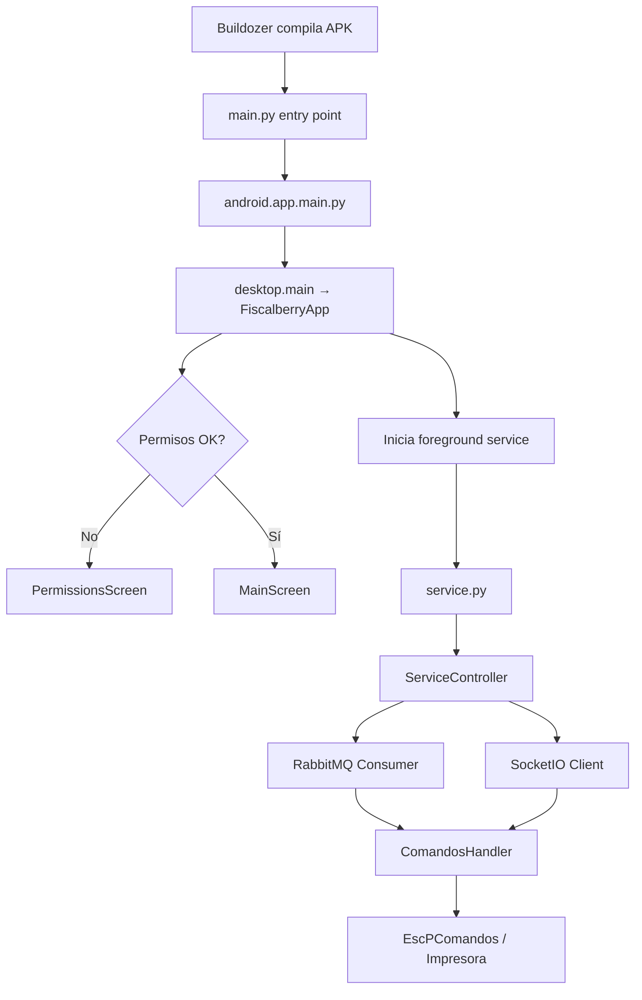

# Fiscalberry Android - Contexto del Proyecto

> **Fecha de generación**: 2025-12-15  
> **Versión actual**: 2.0.1  
> **Objetivo**: Documento de referencia para recuperar contexto del proyecto Fiscalberry Android.

---

## 📍 Ubicación del Proyecto

```
.
```

---

## 🏗️ Arquitectura General

Fiscalberry es un **servidor de impresión fiscal** que funciona como intermediario entre un sistema de punto de venta (POS) y impresoras fiscales/no fiscales. El proyecto tiene una estructura **monorepo** con soporte para múltiples plataformas.

### Variantes de Build

| Variante        | Spec File                    | Descripción             | Tamaño APK |
| --------------- | ---------------------------- | ----------------------- | ---------- |
| **Android UI**  | `buildozer.ui.android.spec`  | Con Kivy GUI completa   | ~49 MB     |
| **Android CLI** | `buildozer.cli.android.spec` | Headless (sin UI)       | ~12-15 MB  |
| **Desktop GUI** | `fiscalberry-gui.spec`       | Kivy para Windows/Linux | -          |
| **Desktop CLI** | `fiscalberry-cli.spec`       | Terminal pura           | -          |

---

## 📂 Estructura de Directorios Relevante

```
fiscalberry/
├── buildozer.ui.android.spec      # Config Android UI (principal)
├── buildozer.cli.android.spec     # Config Android CLI (headless)
├── my_recipes/                    # Recipes customizados p4a
│   ├── jpeg/                      # Fix para libjpeg
│   ├── kivy/                      # Fix compilación Kivy
│   └── pyjnius/                   # Fix pyjnius
├── src/
│   ├── main.py                    # Entry point Android UI
│   ├── main_headless.py           # Entry point Android CLI
│   └── fiscalberry/
│       ├── version.py             # VERSION = "2.0.1"
│       ├── android/               # ← CÓDIGO ESPECÍFICO ANDROID
│       │   ├── permissions.py     # Sistema de permisos runtime
│       │   ├── app/               # Android UI (Kivy)
│       │   │   ├── main.py        # Entry real UI
│       │   │   └── service.py     # Foreground service UI
│       │   └── headless/          # Android CLI
│       │       ├── main.py        # Entry CLI
│       │       ├── service.py     # Foreground service CLI
│       │       └── crash_reporter.py
│       ├── ui/                    # UI Kivy (compartida Desktop/Android)
│       │   ├── fiscalberry_app.py # FiscalberryApp (846 líneas)
│       │   ├── kivy_log_handler.py # Handler logs tiempo real
│       │   ├── adopt_screen.py
│       │   ├── login_screen.py
│       │   ├── main_screen.py
│       │   ├── permissions_screen.py
│       │   ├── log_screen.py
│       │   ├── kv/                # Archivos .kv
│       │   └── assets/
│       ├── common/                # ← CÓDIGO COMPARTIDO (CORE)
│       │   ├── Configberry.py     # Manejo de config.ini
│       │   ├── ComandosHandler.py # Router de comandos JSON
│       │   ├── EscPComandos.py    # Comandos ESC/POS
│       │   ├── service_controller.py  # Control RabbitMQ + SIO
│       │   ├── fiscalberry_sio.py # Cliente SocketIO
│       │   ├── bluetooth_printer.py   # Impresoras Bluetooth
│       │   ├── printer_detector.py
│       │   ├── fiscalberry_logger.py
│       │   └── rabbitmq/          # Cliente RabbitMQ
│       ├── cli/                   # CLI Desktop
│       └── desktop/               # Desktop GUI entry
└── docs/                          # Documentación adicional
```

---

## 🔧 Configuración de Buildozer (Android UI)

### Archivo: [buildozer.ui.android.spec](buildozer.ui.android.spec)

#### Identificadores

- **Package**: `com.paxapos.fiscalberry`
- **Title**: `Fiscalberry`

#### Compatibilidad Android

| Parámetro         | Valor                    | Descripción                          |
| ----------------- | ------------------------ | ------------------------------------ |
| `android.api`     | 35                       | Target API (Android 16)              |
| `android.minapi`  | 22                       | Min API (Android 5.1.1 - POS Payway) |
| `android.ndk_api` | 22                       | NDK API para compatibilidad          |
| `android.archs`   | `arm64-v8a, armeabi-v7a` | Arquitecturas soportadas             |

#### Permisos Declarados

```
INTERNET, FOREGROUND_SERVICE, ACCESS_NETWORK_STATE, ACCESS_WIFI_STATE,
WAKE_LOCK, READ_EXTERNAL_STORAGE, WRITE_EXTERNAL_STORAGE,
BLUETOOTH, BLUETOOTH_ADMIN, BLUETOOTH_SCAN, BLUETOOTH_CONNECT,
ACCESS_COARSE_LOCATION, ACCESS_FINE_LOCATION,
REQUEST_IGNORE_BATTERY_OPTIMIZATIONS
```

#### Dependencias Principales

```python
requirements = hostpython3,python3,kivy,python-escpos,python-barcode,
               appdirs,argcomplete,importlib-resources,pyyaml,setuptools,
               six,qrcode,pillow,pyserial,pyusb,python-socketio[client],
               python-engineio,bidict,simple-websocket,wsproto,h11,
               requests,urllib3,certifi,idna,chardet,platformdirs,
               pyjnius,pika,filetype
```

#### Servicio Foreground

```ini
services = fiscalberryservice:fiscalberry/android/app/service.py:foreground:sticky
```

#### Bootstrap

- **UI**: `sdl2` (requerido para Kivy)
- **CLI**: `webview` (sin gráficos)

---

## 🔑 Componentes Clave Android

### 1. Entry Points

#### [src/main.py](src/main.py) - Android UI

```python
# Redirige a fiscalberry.android.app.main
runpy.run_module('fiscalberry.android.app.main', run_name='__main__')
```

#### [src/main_headless.py](src/main_headless.py) - Android CLI

```python
# Redirige a fiscalberry.android.headless.main
runpy.run_module('fiscalberry.android.headless.main', run_name='__main__')
```

### 2. Sistema de Permisos

#### [permissions.py](src/fiscalberry/android/permissions.py)

Maneja permisos runtime según versión de Android:

| API Level | Permisos Especiales                     |
| --------- | --------------------------------------- |
| < 29      | `READ/WRITE_EXTERNAL_STORAGE`           |
| 31+       | `BLUETOOTH_CONNECT`, `BLUETOOTH_SCAN`   |
| 23+       | `ACCESS_COARSE_LOCATION` (para BT scan) |

**Funciones principales**:

- `get_required_permissions()` - Lista según API level
- `check_all_permissions()` - Verifica otorgados
- `request_all_permissions(callback)` - Solicita con callback
- `request_bluetooth_permissions()` - Específico BT

### 3. Servicio Foreground

#### [android/app/service.py](src/fiscalberry/android/app/service.py) - UI

**Funciones críticas**:

- `create_notification_channel()` - API 26+ (Android 8.0+)
- `show_foreground_notification()` - Mantiene servicio vivo
- `request_battery_exemption()` - Evita Doze mode
- `run_service_logic()` - Loop principal con `ServiceController`

#### [android/headless/service.py](src/fiscalberry/android/headless/service.py) - CLI

Similar pero más simple, delega a `headless/main.py`.

### 4. FiscalberryApp (UI Kivy)

#### [fiscalberry_app.py](src/fiscalberry/ui/fiscalberry_app.py)

**Propiedades reactivas** (StringProperty):

```python
name, uuid, host, tenant, siteName, siteAlias
# Estados de conexión
sio_status, rabbit_status
# Imágenes (vacías para optimizar resume):
background_image, logo_image, connected_image, disconnected_image = ""
```

**Métodos críticos**:
| Método | Descripción |
|--------|-------------|
| `build()` | Construye UI, carga screens |
| `on_start()` | Post-init, inicia servicios |
| `on_pause()` | Background, retorna `True` |
| `on_resume()` | **CRÍTICO**: Limpia caches OpenGL |
| `_request_android_permissions()` | Solicita permisos |
| `_start_android_service()` | Inicia foreground service |

**Problema conocido resuelto**:

- Las imágenes causaban crash en `on_resume()` por destrucción del contexto OpenGL
- **Solución**: Se removieron imágenes (propiedades vacías), UI usa colores sólidos

### 5. Sistema de Logs en Tiempo Real

#### [kivy_log_handler.py](src/fiscalberry/ui/kivy_log_handler.py)

**✅ Multiplataforma** (Desktop + Android)

Handler de logging personalizado que captura mensajes en un buffer circular y los muestra en la UI en tiempo real.

**Características**:

```python
class KivyLogHandler(logging.Handler):
    def __init__(self, max_lines=200):
        self.log_buffer = deque(maxlen=200)  # Buffer circular

    def emit(self, record):
        msg = self.format(record)
        self.log_buffer.append(msg)
        # Actualiza UI en hilo principal (thread-safe)
        Clock.schedule_once(lambda dt: self._update_app_logs(), 0)
```

**Por qué funciona en Android**:

- ✅ `logging.Handler` → Python estándar
- ✅ `deque` → Python estándar
- ✅ `Clock.schedule_once()` → Kivy API multiplataforma
- ❌ NO usa `subprocess`, `os.system`, ni APIs específicas de OS

**Integración**:

```python
# En FiscalberryApp.__init__
self.log_handler = KivyLogHandler(max_lines=200)
self.log_handler.set_app(self)
logging.getLogger().addHandler(self.log_handler)
```

**Resultado**: Los logs aparecen en tiempo real tanto en Desktop como en Android en el panel "REGISTRO DE ACTIVIDAD" de MainScreen.

---

## 🔄 Flujo de Ejecución



---

## 📱 APIs Android Usadas (jnius)

```python
from jnius import autoclass, cast

# Clases frecuentes
PythonService = autoclass('org.kivy.android.PythonService')
PythonActivity = autoclass('org.kivy.android.PythonActivity')
Context = autoclass('android.content.Context')
Build = autoclass('android.os.Build')  # API_LEVEL = Build.VERSION.SDK_INT
Intent = autoclass('android.content.Intent')
Uri = autoclass('android.net.Uri')

# Notificaciones
NotificationBuilder = autoclass('android.app.Notification$Builder')
NotificationManager = autoclass('android.app.NotificationManager')
NotificationChannel = autoclass('android.app.NotificationChannel')  # API 26+

# Power
PowerManager = autoclass('android.os.PowerManager')

# Bluetooth
BluetoothAdapter = autoclass('android.bluetooth.BluetoothAdapter')
BluetoothSocket = autoclass('android.bluetooth.BluetoothSocket')
```

---

## 🛠️ Comandos de Build

### Build UI (con Kivy)

```bash
cd .
buildozer -v android debug -c buildozer.ui.android.spec
```

### Build CLI (headless)

```bash
cd .
buildozer -v android debug -c buildozer.cli.android.spec
```

### Limpiar cache

```bash
buildozer android clean
rm -rf .buildozer/android/platform/build-*
```

### Ver logs del dispositivo

```bash
adb logcat | grep -E "(python|fiscalberry|kivy)"
```

---

## 🐛 Problemas Conocidos y Soluciones

### 1. Crash en `on_resume()` con imágenes

- **Causa**: Android destruye contexto OpenGL al pasar a background
- **Solución**: Removidas todas las imágenes, UI usa colores sólidos
- **Archivos afectados**: `fiscalberry_app.py`, archivos `.kv`

### 2. Servicio muerto por Doze mode

- **Causa**: Android mata servicios después de 30 min en Doze
- **Solución**: `REQUEST_IGNORE_BATTERY_OPTIMIZATIONS` + solicitud runtime

### 3. Bluetooth no funciona en Android 12+

- **Causa**: Nuevos permisos `BLUETOOTH_CONNECT`, `BLUETOOTH_SCAN`
- **Solución**: `permissions.py` detecta API level y solicita dinámicamente

### 4. Kivy crash con Python 3.12

- **Documentado en**: [PROBLEMA_KIVY_PYTHON312_ANDROID.md](docs/PROBLEMA_KIVY_PYTHON312_ANDROID.md)
- **Solución**: Recipes customizados en `my_recipes/`

---

## 📚 Documentación Adicional

| Documento                                                                         | Descripción          |
| --------------------------------------------------------------------------------- | -------------------- |
| [GUIA_COMPLETA_COMPILACION_ANDROID.md](docs/GUIA_COMPLETA_COMPILACION_ANDROID.md) | 60KB guía exhaustiva |
| [ANDROID_BACKGROUND_EXECUTION.md](docs/ANDROID_BACKGROUND_EXECUTION.md)           | Servicios background |
| [KNOWLEDGE_BASE.md](docs/KNOWLEDGE_BASE.md)                                       | Base de conocimiento |
| [Comandos_Basicos.md](docs/Comandos_Basicos.md)                                   | Comandos rápidos     |

---

## 🔗 Archivos Críticos para Modificar

Al trabajar en Fiscalberry Android, estos son los archivos más importantes:

### Entry Points

- [src/main.py](src/main.py)
- [src/main_headless.py](src/main_headless.py)

### Android Específico

- [android/app/service.py](src/fiscalberry/android/app/service.py)
- [android/headless/service.py](src/fiscalberry/android/headless/service.py)
- [android/permissions.py](src/fiscalberry/android/permissions.py)

### UI (Kivy)

- [ui/fiscalberry_app.py](src/fiscalberry/ui/fiscalberry_app.py)
- [ui/kv/](src/fiscalberry/ui/kv)

### Core (compartido)

- [common/service_controller.py](src/fiscalberry/common/service_controller.py)
- [common/Configberry.py](src/fiscalberry/common/Configberry.py)
- [common/bluetooth_printer.py](src/fiscalberry/common/bluetooth_printer.py)

### Configuración Build

- [buildozer.ui.android.spec](buildozer.ui.android.spec)
- [buildozer.cli.android.spec](buildozer.cli.android.spec)
