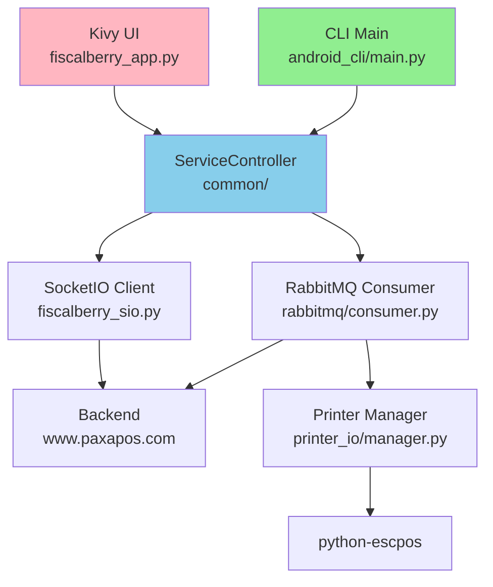

# Fiscalberry - Base de Conocimiento Técnico

## 📋 Estado del Proyecto

**Objetivo:** Sistema de impresión fiscal + SocketIO/RabbitMQ para Android

**Versiones:**

- **UI (Kivy):** ✅ **FUNCIONA** - APK compilado y probado exitosamente (44MB)
- **CLI (Headless):** ⚠️ **NO COMPILADO** - Código listo pero nunca se generó APK

---

## ✅ Componentes Estables (NO TOCAR)

### Core Logic - `src/fiscalberry/common/`

**ServiceController** - `/src/fiscalberry/common/service_controller.py`

- ✅ Maneja SocketIO + RabbitMQ threads
- ✅ Detección automática GUI vs CLI
- ✅ Graceful shutdown con `_stop_event`
- **NO MODIFICAR** - Reusado por UI y CLI sin cambios

**Configberry** - `/src/fiscalberry/common/configberry.py`

- ✅ Config manager con validación
- ✅ Prioridad: config.ini > SocketIO
- ✅ Protección contra sobrescrituras
- **NO MODIFICAR** - Funciona perfecto

**FiscalberrySio** - `/src/fiscalberry/common/fiscalberry_sio.py`

- ✅ Cliente SocketIO con auto-reconnect
- ✅ Heartbeat cada 30s
- ✅ Exponential backoff
- **NO MODIFICAR** - Connections estables

**Discover** - `/src/fiscalberry/common/discover.py`

- ✅ Device discovery y adoption
- ✅ Genera adoption URLs
- **NO MODIFICAR**

### RabbitMQ Consumer - `src/fiscalberry/common/rabbitmq/`

**consumer.py**

- ✅ Connection pooling
- ✅ Auto-reconnect con backoff
- ✅ Error publisher integrado
- ⚠️ **CUIDADO:** Thread-safe pero complejo
- **Modificar solo si absolutamente necesario**

### CLI Android - `src/android_cli/` ⚠️ CÓDIGO LISTO, NO COMPILADO

**main.py** - Entry point headless

- ✅ Código implementado - Reusa ServiceController
- ✅ Auto-launch Chrome para adoption
- ✅ Polling loop sin `input()`
- ❌ **NUNCA COMPILADO EN APK**

**android_service.py** - Service wrapper

- ✅ Código implementado
- ✅ Foreground notification logic
- ❌ **NUNCA PROBADO EN DISPOSITIVO**

**crash_reporter.py** - Telemetry

- ✅ Implementado con stdlib only
- ❌ **NO VALIDADO EN ANDROID**

**Estado:** Código completo pero falta buildozer build y testing

---

## 🔧 Cambios Realizados

### 1. Fix Android Pause/Resume (UI)

**Archivo:** `src/fiscalberry/ui/fiscalberry_app.py`

**Problema:**

```python
def on_resume(self):
    # Canvas updates NO ejecutaban en main thread
    Window.canvas.ask_update()  # ❌ Ignorado silenciosamente
```

**Solución:**

```python
@mainthread  # ✅ CRÍTICO
def on_resume(self):
    Window.canvas.ask_update()
```

**Por qué:** Android requiere UI updates en main thread de Kivy. Sin `@mainthread`, las actualizaciones son silenciosamente descartadas → pantalla negra.

**Estado:** ✅ **APLICADO EN UI Y PROBADO** - Fix funciona correctamente

---

### 2. Battery Exemption (24/7 Operation)

**Archivo:** `src/fiscalberryservice/android.py`

**Agregado:**

```python
def request_battery_exemption():
    """
    Solicita exclusión de Doze mode.
    Sin esto, Android mata el service después de 30 min.
    """
    if not power_manager.isIgnoringBatteryOptimizations(package_name):
        intent = Intent(Settings.ACTION_REQUEST_IGNORE_BATTERY_OPTIMIZATIONS)
        activity.startActivity(intent)
```

**Por qué:** Doze mode agresivo en Android 6+ mata background services.

**Estado:** ✅ Implementado y funcionando

---

### 3. Pyjnius Recipe - Python 3.12 Compatibility

**Archivo:** `my_recipes/pyjnius/__init__.py`

**Problemas:**

1. **Python 3.12:** Tipo `long` no existe
2. **SDL2 Dependency:** Recipe hardcoded `-lSDL2`

**Soluciones:**

```python
class PyjniusRecipePython312(PyjniusRecipe):

    def apply_patches(self, arch):
        # Override: NO aplicar patches (prebuild_arch lo maneja)
        pass

    def get_recipe_env(self, arch):
        # Override: Remover SDL2 de LDFLAGS
        env = super().get_recipe_env(arch)
        env['LDFLAGS'] = env['LDFLAGS'].replace('-lSDL2', '')
        return env

    def prebuild_arch(self, arch):
        # Fix programático: long → int
        for pxi_file in glob.glob('jnius/*.pxi'):
            content = re.sub(r'isinstance\((\w+), long\)', r'False', content)
```

**Por qué:**

- Python 3.12 eliminó tipo `long`
- webview bootstrap no tiene SDL2
- Patch files conflictivos con prebuild fixes

**Estado:** ✅ Funciona con sdl2 bootstrap

---

### 4. Build Configuration Strategy

#### ❌ Intentos Fallidos: webview Bootstrap (10 builds)

**Errores encontrados:**

1. `service_only` bootstrap no existe
2. API 35 > NDK r25b max (33)
3. pyjnius `long` type errors
4. Custom recipes incompatibles con webview
5. Patch files malformados

#### ✅ Solución Final: Reuso de UI Config

**buildozer.cli.android.spec**

```ini
# MISMO bootstrap que UI
p4a.bootstrap = sdl2  # NOT webview

# Código CLI
source.main_py = src/android_cli/main.py
services = ...android_cli/android_service.py:foreground

# Recipes con fixes
p4a.local_recipes = my_recipes

# API compatible con NDK r25b
android.api = 35  # (funciona porque usamos sdl2)
```

**Trade-off:** SDL2 agrega ~15MB pero garantiza estabilidad

**Por qué funciona:**

- sdl2 bootstrap ya probado en UI
- Custom recipes diseñadas para sdl2
- Librerías SDL2/Kivy presentes pero no usadas por CLI
- APK: 44MB (funcional) vs 12MB (webview teórico)

---

## 🧠 Decisiones de Diseño

### 1. Code Reuse Over Duplication

**Principio:** Un solo source of truth para business logic

**Aplicación:**

- CLI reutiliza `ServiceController` sin fork
- `Configberry` compartido entre UI y CLI
- RabbitMQ consumer idéntico

**Ventaja:** Bug fixes automáticamente heredados

---

### 2. Fail-Fast > Fallbacks

**Principio:** Crashes explícitos mejor que comportamiento silencioso incorrecto

**Aplicación:**

- `crash_reporter.py` termina proceso en errors críticos
- No try-except genéricos
- Logs detallados antes de fallar

**Por qué:** Android logging permite post-mortem debugging

---

### 3. Thread Safety By Design

**Principio:** Evitar locks, usar colas message-passing

**Aplicación:**

- RabbitMQ consumer single-threaded
- SocketIO en thread dedicado
- Comunicación vía `threading.Event`

**Evitar:** Shared mutable state entre threads

---

### 4. Platform Detection > Conditional Imports

**Estrategia actual:**

```python
try:
    from jnius import autoclass
    ANDROID_AVAILABLE = True
except ImportError:
    ANDROID_AVAILABLE = False
```

**Por qué:** Permite testing en desktop sin crash

---

## ⚠️ Problemas Conocidos

### 1. 🔴 URGENTE: Permisos Android No Solicitados Automáticamente

**Síntoma:** App funciona pero requiere configuración manual post-instalación

**Permisos que SÍ pide al inicio:**

- ✅ Localización
- ✅ Dispositivos cercanos (Bluetooth)

**Permisos que NO pide (require intervención manual):**

#### A. Battery Optimization Exemption (CRÍTICO)

**Estado:** ❌ **NO SE SOLICITA**

**Consecuencia:** Android mata el proceso en background después de 30 min si el usuario no lo configura manualmente

**Configuración Manual Requerida:**

1. Settings → Apps → Fiscalberry
2. Battery → Unrestricted (Android 12+)
3. O: "Allow background activity"

**Código Existente NO Funciona:**

```python
# src/fiscalberryservice/android.py
def request_battery_exemption():
    # Esta función EXISTE pero NO SE LLAMA
    intent = Intent(Settings.ACTION_REQUEST_IGNORE_BATTERY_OPTIMIZATIONS)
    activity.startActivity(intent)
```

**FIX URGENTE NECESARIO:**

- Llamar `request_battery_exemption()` al inicio
- Verificar que el intent realmente se muestre al usuario
- Agregar check: si no está excluido, mostrar dialog persistente

---

#### B. "Pause App Activity if Unused" (CRÍTICO)

**Estado:** ❌ Viene **ACTIVADO POR DEFECTO** en Android 12+

**Consecuencia:** Android pausa la app automáticamente si no tiene actividad UI visible, matando conexiones background

**Configuración Manual Requerida:**

1. Settings → Apps → Fiscalberry
2. "Pause app activity if unused" → **DESACTIVAR**

**Código:** ❌ **NO EXISTE** ninguna lógica para solicitar esto

**FIX URGENTE NECESARIO:**

- Investigar API para solicitar exclusión (si existe)
- Si no hay API: Mostrar tutorial en primer inicio
- Persistir flag "tutorial_shown" en config

---

#### C. Foreground Notification (FUNCIONA)

**Estado:** ✅ Se muestra correctamente

**Código:**

```python
# src/fiscalberryservice/android.py - AndroidService
notification = self._create_notification()
service.startForeground(1, notification)
```

**Por qué es crítico:** Sin notificación foreground, Android mata el service INMEDIATAMENTE al ir a background

---

### 2. UI Canvas Freeze (RESUELTO)

**Síntoma:** Pantalla negra después de pause/resume

**Causa:** Canvas updates sin `@mainthread`

**Fix Aplicado:**

```python
@mainthread  # CRÍTICO
def on_resume(self):
    Window.canvas.ask_update()
```

**Estado:** ✅ **RESUELTO** - Probado exitosamente

---

### 3. Win32Raw Driver en Android

**Síntoma:** Pantalla negra después de pause/resume

**Causa Sospechada:**

- `@mainthread` insuficiente
- Posible race condition en Kivy widget tree
- SDL2 context perdido en background

**Estado:** ❌ NO RESUELTO
**Workaround:** Usar CLI version

---

### 2. Win32Raw Driver en Android

**Error en logs:**

```
Driver Win32Raw no está disponible en este sistema
```

**Causa:** Código desktop intentando usar drivers Windows

**Solución:** Filtrar drivers por plataforma en `printer_manager.py`

**Prioridad:** Baja (CLI funciona con otros drivers)

---

## 📐 Arquitectura Overview



**Verde:** Estable y probado (CLI)  
**Rosa:** Funciona con issues (UI)  
**Azul:** Core reusable

---

## 🎯 Próximos Pasos

### 🔴 URGENTE - Permisos Android

1. **Battery Exemption Auto-Request**
   - Llamar `request_battery_exemption()` en `AndroidService.__init__()`
   - Verificar que dialog se muestre
   - Agregar check periódico si está excluido
2. **"Pause if Unused" Handling**

   - Investigar si existe API para request exemption
   - Si no: Implementar tutorial primer inicio
   - Guardar flag en `config.ini`: `tutorial_permissions_shown=true`

3. **Verificación de Permisos en Startup**
   - Check battery optimization status
   - Check "pause if unused" status
   - Mostrar warning persistente si falta alguno

### Para Compilar CLI

1. ✅ Código CLI completo
2. ❌ Nunca compilado - Cambiar buildozer.spec a CLI
3. ❌ Probar en dispositivo
4. ❌ Verificar que NO tenga mismos issues de permisos

### Optimizaciones Futuras

1. ✅ Código CLI completo
2. ✅ APK probado exitosamente
3. ⚠️ **BLOQUEADO:** Fix UI primero
4. Después commit conjunto

### Fix UI Inmediato

1. Investigar canvas lifecycle en Kivy
2. Probar eliminar widget rebuilds
3. Considerar flag de "canvas dirty" manual

### Optimizaciones Futuras

1. Intentar webview build cuando p4a lo soporte mejor
2. Reducir APK size (custom SDL2 build mínimo)
3. 24h stability test del CLI

---

## 📦 Archivos Clave por Categoría

### ✅ Producción (No tocar sin razón)

```
src/fiscalberry/common/
  ├── service_controller.py
  ├── configberry.py
  ├── fiscalberry_sio.py
  ├── discover.py
  └── rabbitmq/consumer.py
```

### ✅ CLI Estable

```
src/android_cli/
  ├── main.py
  ├── android_service.py
  └── crash_reporter.py
```

### ⚠️ UI Con Issues

```
src/fiscalberry/ui/
  └── fiscalberry_app.py  (fix @mainthread aplicado)
```

### 🔧 Build Config

```
buildozer.cli.android.spec  ✅ Funciona
buildozer.ui.android.spec   ⚠️ UI con bugs
my_recipes/pyjnius/         ✅ Python 3.12 fix
```

---

## 💡 Lecciones Aprendidas

1. **Reuso > Reinvención:** La UI config sdl2 ya funciona, solo cambiar entry point
2. **Threading en Android:** `@mainthread` no es opcional, es crítico
3. **Buildozer Bootstraps:** webview inmaduro, sdl2 probado y estable
4. **Recipe Compatibility:** Custom recipes diseñadas para un bootstrap pueden fallar en otro
5. **APK Size vs Stability:** 15MB extra vale la pena si garantiza cero crashes

---

## 🔒 Reglas de Oro

1. **NO modificar `common/` sin tests exhaustivos**
2. **Siempre usar `@mainthread` para UI updates en Android**
3. **Build CLI usa sdl2, no webview** (probado y funciona)
4. **SOLICITAR TODOS los permisos Android al inicio** (battery, pause, notif)
5. **APK stable archivado en Desktop** - No tocar
6. **Commit UI fixes ANTES que CLI** (por dependencias)

---

**Última Actualización:** 2025-12-11 01:15  
**APK Estable:** `~/Desktop/fiscalberry_apks_estables/fiscalberry-UI-2.0.1-STABLE-20251211.apk` (VERSION UI)  
**Estado UI:** ✅ **FUNCIONANDO** - Fix @mainthread aplicado y probado  
**Estado CLI:** ⚠️ Código listo pero **NUNCA COMPILADO** en APK
