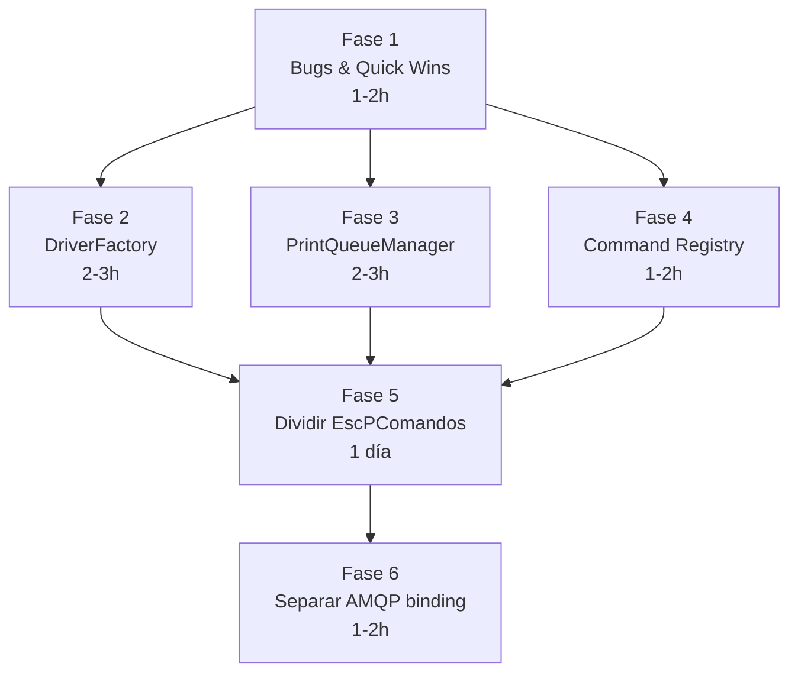

# 🏗️ Plan de Refactorización — Clean Architecture

> Rama: `refactor/clean-architecture` basada en `v3.0.x`  
> Fecha: 2026-03-04  
> Total de código Python: 8811 líneas en 30+ archivos

---

## 1. Patrón de diseño recomendado

### ¿Por qué Clean Architecture adaptada + Strategy + Registry?

Se evaluaron 3 opciones y se eligió la combinación que mejor encaja con Fiscalberry:

| Patrón | Aplica? | Razón |
|---|---|---|
| Clean Architecture (Capas) | ✅ **Sí** | El proyecto ya tiene `common/`, `ui/`, `cli/`, `android/` — solo falta separar lógica de negocio de infraestructura dentro de `common/` |
| Strategy Pattern | ✅ **Sí** | Los drivers de impresora (USB, Network, Bluetooth...) y los tipos de documento (Factura, Remito, Comanda...) son variantes intercambiables |
| Registry Pattern | ✅ **Sí** | Reemplaza los if-elif chains con un diccionario de registro automático |
| Hexagonal / Ports & Adapters | ❌ Sobredimensionado | No tenemos múltiples bases de datos ni APIs externas que justifiquen ports |
| MVC/MVVM completo | ❌ Parcial | Solo la UI Kivy lo usaría, no justifica reimplementar todo |

---

### 1.1. ¿Qué es el Strategy Pattern y cómo aplica aquí?

El **Strategy Pattern** define una familia de algoritmos intercambiables. En vez de un `if-elif` que decide qué hacer según un string, cada variante se encapsula en su propia clase con la misma interfaz.

**Antes (código actual):**
```python
# ComandosHandler.py — runTraductor()
if driverName == "usb":
    # 15 líneas de lógica USB
elif driverName == "network":
    # 5 líneas de lógica Network
elif driverName == "bluetooth":
    # 20 líneas de lógica Bluetooth
elif driverName == "serial":
    # ...
# 9 ramas más
```

**Después (con Strategy):**
```python
# Cada driver es una Strategy con la misma interfaz

class DriverStrategy(ABC):
    """Interfaz que todos los drivers deben cumplir."""
    
    @abstractmethod
    def create(self, config: dict) -> object:
        """Crea y retorna una instancia del driver ESC/POS."""
        ...
    
    @abstractmethod
    def validate_config(self, config: dict) -> None:
        """Valida la configuración antes de crear el driver."""
        ...


class UsbDriver(DriverStrategy):
    def validate_config(self, config):
        if 'idProduct' not in config:
            raise DriverError("USB requiere idProduct")
    
    def create(self, config):
        self.validate_config(config)
        # Convertir hex strings a int
        config['idProduct'] = int(config['idProduct'], 16)
        config['idVendor'] = int(config['idVendor'], 16)
        if 'out_ep' in config:
            config['out_ep'] = int(config['out_ep'], 16)
        return printer.Usb(**config)


class NetworkDriver(DriverStrategy):
    def validate_config(self, config):
        pass  # Network no requiere validación especial
    
    def create(self, config):
        if 'port' in config:
            config['port'] = int(config['port'])
        return printer.Network(**config)


class BluetoothDriver(DriverStrategy):
    def validate_config(self, config):
        if 'mac_address' not in config and 'macAddress' not in config:
            raise DriverError("Bluetooth requiere mac_address")
    
    def create(self, config):
        self.validate_config(config)
        if 'macAddress' in config:
            config['mac_address'] = config.pop('macAddress')
        from fiscalberry.common.bluetooth_printer import BluetoothPrinter
        return BluetoothPrinter(**config)
```

---

### 1.2. ¿Qué es el Registry Pattern y cómo aplica aquí?

El **Registry** es un diccionario que mapea nombres a clases. Elimina los `if-elif` de despacho. Puede ser manual o automático con decoradores.

**Registro manual (más simple, recomendado para empezar):**
```python
# drivers/registry.py

DRIVER_REGISTRY: dict[str, DriverStrategy] = {
    "usb":       UsbDriver(),
    "network":   NetworkDriver(),
    "bluetooth": BluetoothDriver(),
    "serial":    SerialDriver(),
    "file":      FileDriver(),
    "dummy":     DummyDriver(),
    "cups":      CupsDriver(),
    "lp":        LPDriver(),
    "win32raw":  Win32RawDriver(),
}

def get_driver(name: str) -> DriverStrategy:
    """Obtiene un driver por nombre. Lanza DriverError si no existe."""
    driver = DRIVER_REGISTRY.get(name.lower())
    if not driver:
        raise DriverError(f"Driver '{name}' no registrado. Disponibles: {list(DRIVER_REGISTRY.keys())}")
    return driver
```

**Uso en runTraductor (después del refactor):**
```python
def runTraductor(jsonTicket, queue):
    printerName = jsonTicket.pop('printerName')
    dictSectionConf = configberry.get_config_for_printer(printerName)
    driverName = dictSectionConf.pop("driver", "Dummy")
    
    # UNA LÍNEA reemplaza todo el if-elif chain
    strategy = get_driver(driverName)
    columns = dictSectionConf.pop('columns', None)
    driver_instance = strategy.create(dictSectionConf)
    
    comando = EscPComandos(driver_instance, columns=columns)
    return comando.run(jsonTicket)
```

**Registro automático (más avanzado, con decorador):**
```python
# Si el día de mañana querés que registrar un driver sea simplemente crear un archivo:

def register_driver(name: str):
    """Decorador para registrar un driver automáticamente."""
    def decorator(cls):
        DRIVER_REGISTRY[name.lower()] = cls()
        return cls
    return decorator

@register_driver("usb")
class UsbDriver(DriverStrategy):
    ...
```

Con esto, agregar un nuevo driver = crear 1 archivo nuevo. **Nunca más se toca** `ComandosHandler.py`.

---

### 1.3. Capas propuestas (Clean Architecture adaptada)

```
src/fiscalberry/
├── core/                    ← CAPA DE NEGOCIO (sin dependencias externas)
│   ├── commands/            ← Command handlers (despacho de comandos)
│   │   ├── __init__.py
│   │   ├── registry.py      ← Registro de comandos (reemplaza if-elif)
│   │   └── handlers.py      ← getStatus, configure, etc.
│   ├── drivers/             ← Strategies de drivers de impresora
│   │   ├── __init__.py
│   │   ├── base.py           ← ABC DriverStrategy
│   │   ├── registry.py       ← DRIVER_REGISTRY dict
│   │   ├── usb.py
│   │   ├── network.py
│   │   ├── bluetooth.py
│   │   ├── serial.py
│   │   ├── file.py
│   │   ├── dummy.py
│   │   ├── cups.py
│   │   └── lp.py
│   ├── printing/            ← Strategies de tipos de documento
│   │   ├── __init__.py
│   │   ├── base.py           ← ABC DocumentPrinter
│   │   ├── factura.py        ← printFacturaElectronica
│   │   ├── remito.py         ← printRemito
│   │   ├── comanda.py        ← printComanda
│   │   ├── arqueo.py         ← printArqueo
│   │   ├── pedido.py         ← printPedido
│   │   └── utils.py          ← pad(), floatToString(), safe_parse_date()
│   └── config.py            ← Configberry (sin cambios grandes)
│
├── infra/                   ← CAPA DE INFRAESTRUCTURA (I/O, protocolos)
│   ├── messaging/
│   │   ├── mqtt_consumer.py  ← RabbitMQConsumer (actual consumer.py)
│   │   ├── amqp_binding.py   ← Lógica de binding AMQP (extraída del consumer)
│   │   ├── error_publisher.py
│   │   └── process_handler.py
│   ├── socketio/
│   │   └── sio_client.py     ← FiscalberrySio
│   ├── print_queue.py        ← PrintQueueManager (workers extraídos)
│   └── logging.py            ← Logger unificado
│
├── ui/                      ← SIN CAMBIOS (Kivy screens)
├── cli/                     ← SIN CAMBIOS
├── android/                 ← SIN CAMBIOS
└── desktop/                 ← SIN CAMBIOS
```

---

## 2. Plan de ejecución detallado

### Fase 1 — Eliminar bugs y quick wins (1-2 horas)

| # | Archivo | Qué hacer | Impacto |
|---|---|---|---|
| 1.1 | `ComandosHandler.py:61-92` | Corregir la lógica invertida del `elif qsize > 200` (bug real que nunca se ejecuta) | 🔴 Crítico |
| 1.2 | `ComandosHandler.py:21,29` | Eliminar `logging = getLogger()` duplicado, usar solo `logger` en todo el archivo | 🟡 Limpieza |
| 1.3 | `fiscalberry_sio.py:192-206` | Simplificar `isRabbitMQRunning()` / `isSioRunning()` → `return bool(x and x.is_alive())` | 🟡 Limpieza |

---

### Fase 2 — Extraer DriverFactory (2-3 horas)

**Objetivo:** Eliminar el if-elif de 9 ramas en `runTraductor()`.

| # | Acción | Archivos |
|---|---|---|
| 2.1 | Crear `core/drivers/base.py` con `DriverStrategy` ABC | [NUEVO] |
| 2.2 | Crear un archivo por driver: `usb.py`, `network.py`, `bluetooth.py`, etc. | [NUEVO] ×9 |
| 2.3 | Crear `core/drivers/registry.py` con `DRIVER_REGISTRY` y `get_driver()` | [NUEVO] |
| 2.4 | Refactorizar `runTraductor()` para usar `get_driver()` | `ComandosHandler.py` |
| 2.5 | Eliminar las 140 líneas del if-elif chain | `ComandosHandler.py` |

**Tests:** Ejecutar manualmente un comando de impresión con driver Dummy para verificar que el registry funciona.

---

### Fase 3 — Extraer PrintQueueManager (2-3 horas)

**Objetivo:** Mover la cola de impresión y workers fuera del nivel de módulo.

| # | Acción | Archivos |
|---|---|---|
| 3.1 | Crear `infra/print_queue.py` con clase `PrintQueueManager` | [NUEVO] |
| 3.2 | Mover `print_queue`, `process_print_jobs()`, `report_queue_status()` | De `ComandosHandler.py` |
| 3.3 | Agregar métodos `start()`, `stop()`, `submit_job()` | `print_queue.py` |
| 3.4 | Actualizar `ComandosHandler` para usar `PrintQueueManager.submit_job()` | `ComandosHandler.py` |
| 3.5 | Inicializar `PrintQueueManager.start()` en los entrypoints (`cli/main.py`, `desktop/main.py`, etc.) en vez de al importar | Múltiples entrypoints |

**Estructura de `PrintQueueManager`:**
```python
class PrintQueueManager:
    """Gestiona la cola de impresión y los workers."""
    
    def __init__(self, max_workers=3, max_queue_size=500):
        self._queue = Queue(maxsize=max_queue_size)
        self._workers = []
        self._max_workers = max_workers
        self._running = False
    
    def start(self):
        """Inicia los workers. Llamar explícitamente desde el entrypoint."""
        if self._running:
            return
        for i in range(self._max_workers):
            w = threading.Thread(target=self._process_jobs, args=(i,), daemon=True)
            w.start()
            self._workers.append(w)
        self._running = True
    
    def stop(self):
        """Detiene los workers limpiamente."""
        for _ in self._workers:
            self._queue.put(None)
        self._running = False
    
    def submit_job(self, jsonTicket, timeout=30) -> dict:
        """Encola un trabajo y espera el resultado."""
        q = Queue()
        self._queue.put_nowait((jsonTicket, q))
        return q.get(timeout=timeout)
    
    def _process_jobs(self, worker_id):
        """Worker loop."""
        ...
```

---

### Fase 4 — Extraer Command Registry (1-2 horas)

**Objetivo:** Reemplazar el if-elif de despacho de comandos en `__json_to_comando()`.

| # | Acción | Archivos |
|---|---|---|
| 4.1 | Crear `core/commands/registry.py` con `COMMAND_REGISTRY` | [NUEVO] |
| 4.2 | Crear `core/commands/handlers.py` con funciones: `get_status()`, `configure()`, `reboot()`, etc. | [NUEVO] |
| 4.3 | Refactorizar `__json_to_comando()` para usar dispatch dict | `ComandosHandler.py` |

**Resultado:**
```python
COMMAND_REGISTRY = {
    'getStatus':           lambda self, data: self._getStatus(),
    'reboot':              lambda self, data: self._reboot(),
    'restart':             lambda self, data: self._restartService(),
    'upgrade':             lambda self, data: self._upgrade(),
    'getPrinterInfo':      lambda self, data: self._getPrinterInfo(data),
    'getAvailablePrinters':lambda self, data: self._getAvailablePrinters(),
    'getActualConfig':     lambda self, data: self._getActualConfig(data),
    'configure':           lambda self, data: self._configure(**data),
    'removerImpresora':    lambda self, data: self._removerImpresora(data),
}

def __json_to_comando(self, jsonTicket):
    if 'printerName' in jsonTicket:
        return self._handle_print(jsonTicket)
    
    for key, handler in COMMAND_REGISTRY.items():
        if key in jsonTicket:
            return {"rta": handler(self, jsonTicket[key])}
    
    raise TraductorException("No se pasó un comando válido")
```

---

### Fase 5 — Dividir EscPComandos (1 día)

**Objetivo:** El God Object de 1193 líneas se divide por tipo de documento.

| # | Acción | Archivo original → Archivos nuevos |
|---|---|---|
| 5.1 | Crear `core/printing/base.py` con `DocumentPrinter` ABC y utilidades compartidas (`pad`, `floatToString`, `__initPrinter`, `__printExtras`, `_setTrailer`) | [NUEVO] |
| 5.2 | Crear `core/printing/factura.py` ← extraer `printFacturaElectronica()` + `_printTransparenciaFiscal()` | [NUEVO] ~300 líneas |
| 5.3 | Crear `core/printing/remito.py` ← extraer `printRemito()` + `_printPagoSimple()` + `_printPagoDetallado()` | [NUEVO] ~150 líneas |
| 5.4 | Crear `core/printing/comanda.py` ← extraer `printComanda()` | [NUEVO] ~90 líneas |
| 5.5 | Crear `core/printing/arqueo.py` ← extraer `printArqueo()` | [NUEVO] ~230 líneas |
| 5.6 | Crear `core/printing/pedido.py` ← extraer `printPedido()` | [NUEVO] ~80 líneas |
| 5.7 | Mantener `EscPComandos` como fachada que delega a las clases especializadas | `EscPComandos.py` se reduce a ~100 líneas |

**Interfaz base:**
```python
# core/printing/base.py

class DocumentPrinter(ABC):
    """Base para todos los tipos de documento imprimible."""
    
    def __init__(self, escpos, total_cols=40, price_cols=12, cant_cols=6):
        self.escpos = escpos
        self.printer = escpos.printer
        self.total_cols = total_cols
        self.price_cols = price_cols
        self.cant_cols = cant_cols
        self.desc_cols = total_cols - cant_cols - price_cols
        self.desc_cols_ext = total_cols - price_cols
        self.signo = "$"
    
    @abstractmethod
    def print(self, **kwargs) -> bool:
        """Imprimir el documento."""
        ...
    
    def init_printer(self):
        """Inicializar la impresora con valores por defecto."""
        self.printer.set(align='left', font='a', bold=False, ...)
    
    def print_extras(self, kwargs):
        """Imprimir QRs y barcodes."""
        ...
    
    def set_trailer(self, trailer_lines):
        """Imprimir trailer."""
        ...
```

**EscPComandos después del refactor (fachada):**
```python
# EscPComandos.py — queda como Facade de ~100 líneas

class EscPComandos:
    def __init__(self, printer, columns=None):
        self.printer = printer
        self.columns_config = ColumnsConfig(columns)
    
    def run(self, jsonTicket):
        with EscposIO(self.printer, autocut=False, autoclose=True) as escpos:
            # El despacho de acciones usa el mismo mecanismo
            # pero cada acción delega a su clase especializada
            ...
    
    def printFacturaElectronica(self, escpos, **kwargs):
        return FacturaPrinter(escpos, self.columns_config).print(**kwargs)
    
    def printRemito(self, escpos, **kwargs):
        return RemitoPrinter(escpos, self.columns_config).print(**kwargs)
    
    def printComanda(self, escpos, comanda, **kwargs):
        return ComandaPrinter(escpos, self.columns_config).print(comanda, **kwargs)
    
    def printArqueo(self, escpos, **kwargs):
        return ArqueoPrinter(escpos, self.columns_config).print(**kwargs)
    
    def printPedido(self, escpos, **kwargs):
        return PedidoPrinter(escpos, self.columns_config).print(**kwargs)
```

---

### Fase 6 — Separar binding AMQP del consumer MQTT (1-2 horas)

| # | Acción | Archivos |
|---|---|---|
| 6.1 | Crear `infra/messaging/amqp_binding.py` con `AMQPBindingManager` | [NUEVO] |
| 6.2 | Extraer `_create_queue_binding()` del consumer | `consumer.py` |
| 6.3 | El consumer invoca `AMQPBindingManager.create_binding()` tras conectarse | `consumer.py` |

---

## 3. Orden de ejecución y dependencias



> Las fases 2, 3 y 4 son **independientes entre sí** y pueden hacerse en paralelo. La fase 5 depende de las anteriores porque toca los mismos archivos. La fase 6 es independiente de todo.

---

## 4. Resumen de impacto por archivo

| Archivo actual | Líneas hoy | Líneas después | Qué le pasa |
|---|---|---|---|
| `ComandosHandler.py` | 702 | ~200 | Se le extraen drivers, queue, y command dispatch |
| `EscPComandos.py` | 1193 | ~100 | Se convierte en fachada que delega a 5 clases |
| `consumer.py` | 408 | ~350 | Se le extrae el binding AMQP |
| `fiscalberry_sio.py` | 252 | ~240 | Limpieza menor |
| **Archivos nuevos** | — | ~1500 | Drivers (9×50), Printers (5×100), PrintQueueManager, registries |
| **Total** | 8811 | ~8800 | Similar cantidad pero mejor distribuida |

> [!NOTE]
> El total de líneas no baja mucho porque no estamos eliminando funcionalidad. Lo que cambia es la **distribución**: en vez de 2 archivos de 700-1200 líneas, tenés 20 archivos de 50-150 líneas especializados.

---

## 5. Plan de verificación

| Fase | Cómo verificar |
|---|---|
| Fase 1 | Revisar que `report_queue_status()` loguea el nivel correcto para cada umbral |
| Fase 2 | Enviar un JSON de impresión con driver `Dummy` y verificar que imprime |
| Fase 3 | Verificar que los workers no se lanzan al importar, sino al llamar `start()` |
| Fase 4 | Enviar comandos `getStatus`, `getAvailablePrinters` y verificar respuestas |
| Fase 5 | Imprimir Factura, Remito, Comanda, Arqueo con driver Dummy y comparar output |
| Fase 6 | Verificar que el binding AMQP se crea tras conectarse al MQTT |
