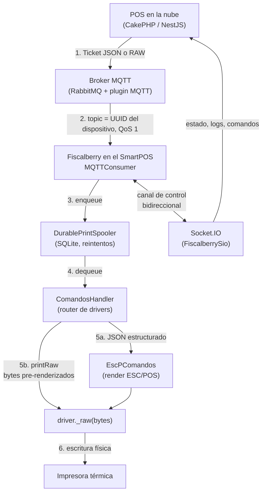
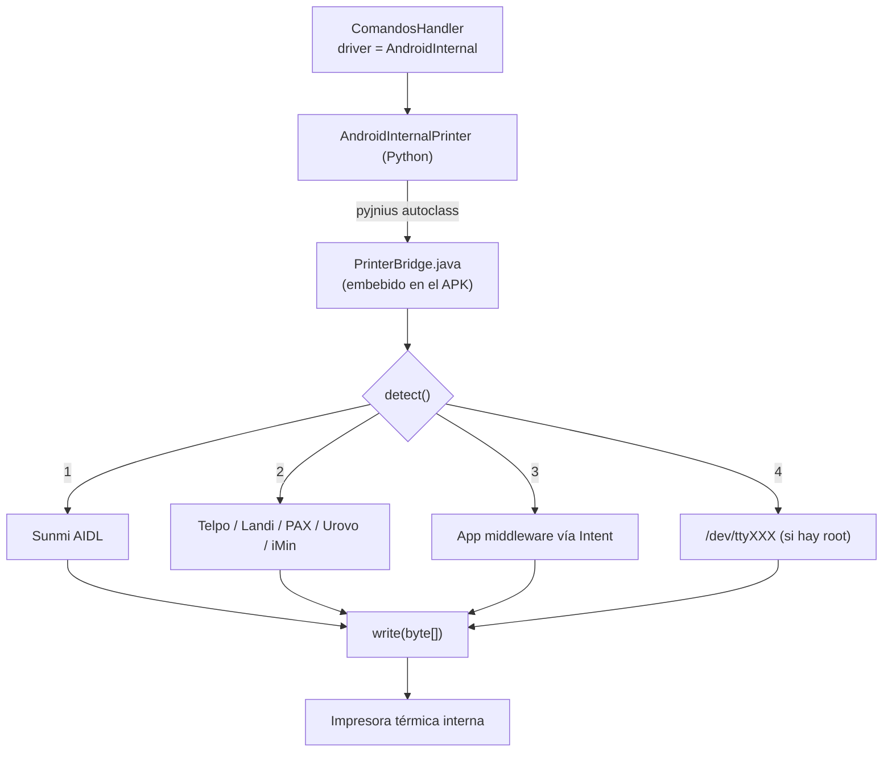

# Fiscalberry en SmartPOS Android — Guía integral de implementación

> **Objetivo**: que Fiscalberry corra de forma autónoma dentro de cualquier terminal
> SmartPOS/PDA Android con impresora térmica integrada, sin depender de una Raspberry Pi
> ni de una PC en el local.
>
> **Alcance decidido**:
> - ❌ **No** hay un modelo de PDA concreto → el driver debe ser **universal con autodetección**.
> - ✅ En el dispositivo corre **solo Fiscalberry** (no hay app POS local compitiendo por RAM).
> - ✅ El POS sigue estando en la nube; el SmartPOS es una **impresora inteligente conectada**.
>
> Documento complementario: [FISCALBERRY_ANDROID_CONTEXT.md](FISCALBERRY_ANDROID_CONTEXT.md)
> (inventario de archivos y specs). Este documento explica **el porqué, el cómo y el qué falta**.

---

## Índice

1. [Resumen ejecutivo](#1-resumen-ejecutivo)
2. [Qué es un SmartPOS y por qué es distinto](#2-qué-es-un-smartpos-y-por-qué-es-distinto)
3. [Cómo funciona Fiscalberry hoy (flujo end-to-end)](#3-cómo-funciona-fiscalberry-hoy-flujo-end-to-end)
4. [Mapa de archivos](#4-mapa-de-archivos)
5. [Conocimientos requeridos](#5-conocimientos-requeridos)
6. [Estado actual: qué está y qué falta](#6-estado-actual-qué-está-y-qué-falta)
7. [El problema central: la impresora interna](#7-el-problema-central-la-impresora-interna)
8. [Diseño propuesto: driver universal en cascada](#8-diseño-propuesto-driver-universal-en-cascada)
9. [Entorno de build](#9-entorno-de-build)
10. [Plan de implementación por fases](#10-plan-de-implementación-por-fases)
11. [Configuración y puesta en marcha del dispositivo](#11-configuración-y-puesta-en-marcha-del-dispositivo)
12. [Testing y troubleshooting](#12-testing-y-troubleshooting)
13. [Glosario](#13-glosario)

---

## 1. Resumen ejecutivo

### Lo que ya está resuelto

Fiscalberry **ya compila y corre en Android**. Existen dos variantes de APK, servicio en
foreground con WakeLock, driver Bluetooth nativo, cola durable en SQLite, soporte de papel
58 mm y modo de impresión RAW. No hay que empezar de cero.

### Lo único que bloquea el despliegue

**No existe un driver capaz de escribir en la impresora térmica integrada del SmartPOS.**

Los drivers actuales (`Usb`, `Network`, `Serial`, `Bluetooth`, `File`, `Cups`, `LP`, `Win32Raw`)
asumen una impresora *externa*. En un SmartPOS la impresora está soldada a la placa, conectada
por un bus UART interno que **solo es accesible a través del SDK Java del fabricante**.

### La solución

Un **puente Java (`PrinterBridge.java`) embebido en el APK**, que:

1. Prueba en cascada los SDK de los fabricantes más comunes.
2. Si ninguno responde, delega a apps middleware instaladas.
3. Expone a Python una única función: `write(byte[])`.

Python (vía pyjnius) no necesita saber qué marca de PDA es. Un solo APK sirve para todo el parque.

### Esfuerzo estimado

| Fase | Contenido | Complejidad |
|------|-----------|-------------|
| 1 | Puente Java + driver Python + registro en el dispatcher | Alta |
| 2 | Autodetección y reporte de capacidad al backend | Media |
| 3 | Ajustes 58 mm (QR, columnas) | Baja |
| 4 | Hardening (rotación de logs, boot receiver) | Baja |
| 5 | Onboarding y build CI | Media |

---

## 2. Qué es un SmartPOS y por qué es distinto

### 2.1 Definición

Un **SmartPOS** (o PDA POS) es un terminal Android todo-en-uno que integra en un mismo chasis:

- Pantalla táctil (5"–5.5")
- **Impresora térmica de 58 mm integrada**
- Escáner de códigos (cámara o láser)
- Conectividad Wi-Fi / 4G / Bluetooth
- Batería

Se venden bajo nombres genéricos ("Impresora de Recibos PDA Android 5 Pulgadas 2GB 16GB") y
detrás hay múltiples fabricantes asiáticos: **Sunmi, Telpo, Landi, PAX, Urovo, iMin, Sunyard,
Bisofice, UNIWA, Baode**, re-etiquetados localmente como **Gadnic, Nictom**, etc.

### 2.2 Diferencias críticas vs. una Raspberry Pi

| Aspecto | Raspberry Pi | SmartPOS Android |
|---------|--------------|------------------|
| Acceso a la impresora | `/dev/usb/lp0` o USB directo | **Solo vía SDK Java del fabricante** |
| Sistema operativo | Linux completo, root disponible | Android sandboxed, sin root |
| Procesos en background | systemd, sin límite | Foreground Service + WakeLock obligatorios |
| Gestión de energía | Ninguna | Doze mode, App Standby, Low Memory Killer |
| Persistencia | Filesystem libre | Scoped storage, app-private dirs |
| Ancho de papel | 80 mm (40 columnas) | **58 mm (32 columnas, 384 dots)** |

### 2.3 Restricciones de hardware que condicionan el diseño

| Recurso | Valor típico | Consecuencia de diseño |
|---------|--------------|------------------------|
| RAM | 2 GB (≈800 MB–1 GB libres tras el SO) | Usar la variante **headless** (sin Kivy). Evitar librerías pesadas. |
| Almacenamiento | 16 GB (≈6 GB útiles) | **Rotación de logs obligatoria**. La cola SQLite debe purgarse. |
| CPU | ARM Quad/Octa-core | Suficiente. No es cuello de botella. |
| Batería | 3000–5000 mAh | WakeLock drena batería → el equipo debe estar en base/enchufado. |
| Impresora | 203 DPI, **384 dots**, 48 mm efectivos | 32 caracteres por línea (Font A 12×24). QR ≤ 384 px. |
| Buffer impresora | 10–32 KB | No volcar sin control → **cola serializada** (ya implementada). |

---

## 3. Cómo funciona Fiscalberry hoy (flujo end-to-end)

> ⚠️ **Corrección importante**: Fiscalberry **ya no** expone un servidor WebSocket local en
> el puerto 12000. Ese es el modelo legacy de la v1 (Docker/RPi). El `puerto = 12000` que
> aparece en `config.ini.install` es residuo histórico.
>
> El modelo actual es **pull desde la nube por MQTT**.

### 3.1 Diagrama de flujo



### 3.2 Los tres canales de comunicación

| Canal | Protocolo | Dirección | Para qué sirve | Archivo |
|-------|-----------|-----------|----------------|---------|
| **Cola de impresión** | MQTT (paho), puerto 1883, QoS 1 | Nube → Dispositivo | Tickets a imprimir | `common/rabbitmq/consumer.py` |
| **Control / management** | Socket.IO | Bidireccional | Iniciar/parar el consumer, logs en vivo, heartbeat | `common/fiscalberry_sio.py` |
| **Discover** | HTTP POST | Dispositivo → Nube | Anuncia IP, UUID e impresoras detectadas | `common/discover.py` |

**Detalle del MQTT**: el *topic* al que se suscribe el dispositivo **es su propio UUID**.
Cada Fiscalberry escucha únicamente su cola. Opcionalmente crea un binding AMQP legacy
(`create_amqp_binding=true`) para compatibilidad con el exchange existente.

### 3.3 Ciclo de vida en Android

```
Usuario abre el APK
        │
        ▼
main_headless.py  →  fiscalberry/android/headless/main.py
        │
        ├─ Configberry(): lee config.ini (UUID, sio_host)
        ├─ send_discover(): anuncia el equipo al backend
        ├─ ¿is_comercio_adoptado()?
        │     └─ NO → abre Chrome en {host}/adopt/{uuid} y hace polling cada 30 s
        │
        ▼
ServiceController.start()
        │
        ├─ Foreground Service (notificación persistente)
        ├─ acquire_wakelock()      → CPU no entra en deep sleep
        ├─ acquire_wifi_lock()     → Wi-Fi en modo high performance
        ├─ request_battery_exemption() → excluye de Doze
        │
        ▼
FiscalberrySio conecta → el backend emite "start_rabbit"
        │
        ▼
MQTTConsumer.subscribe(topic=UUID, qos=1)
        │
        ▼
   [ esperando tickets 24/7 ]
```

### 3.4 Los dos modos de impresión

#### Modo A — JSON estructurado (clásico)

El backend envía un ticket semántico; el dispositivo lo renderiza.

```json
{
  "printerName": "IMPRESORA_INTERNA",
  "printTicket": {
    "encabezado": { "tipo_cmp": "FA" },
    "items": [{ "ds": "Empanada", "qty": 2, "importe": 1500 }]
  }
}
```

- Lo procesa `EscPComandos` con `columns` (32 para 58 mm).
- **Contra**: cambiar el formato exige actualizar los APKs de toda la calle.

#### Modo B — RAW (recomendado para SmartPOS) ⭐

El backend renderiza los bytes ESC/POS y los manda comprimidos.

```json
{
  "printerName": "IMPRESORA_INTERNA",
  "printRaw": {
    "data": "<base64 de gzip(bytes ESC/POS)>",
    "encoding": "gzip+base64"
  }
}
```

Implementado en [`ComandosHandler.py`](../src/fiscalberry/common/ComandosHandler.py):

```python
raw_cmd = jsonTicket.get("printRaw")
data = base64.b64decode(raw_cmd["data"])
if raw_cmd.get("encoding") in ("gzip", "gzip+base64"):
    data = gzip.decompress(data)
driver._raw(data)
```

**Por qué es la vía correcta en SmartPOS:**

| Ventaja | Impacto |
|---------|---------|
| El QR de ARCA se rasteriza en el backend | Evita depender del firmware chino, que suele fallar con QR nativos densos |
| Cambiar formato = deploy de backend | No hay que actualizar cientos de APKs instalados |
| El cliente solo necesita `write(bytes)` | **El driver universal se reduce a una sola función** |
| Menos CPU/RAM en el dispositivo | Crítico con 2 GB |

> 🎯 **Decisión arquitectónica**: en SmartPOS, priorizar el modo RAW. El driver nuevo solo
> tiene que saber escribir bytes.

---

## 4. Mapa de archivos

### 4.1 Núcleo compartido (`src/fiscalberry/common/`)

| Archivo | Responsabilidad | ¿Se toca? |
|---------|-----------------|-----------|
| `ComandosHandler.py` | **Router de drivers** + modo RAW + pool de workers | ✅ Sí (registrar driver nuevo) |
| `EscPComandos.py` | Renderizado ESC/POS, columnas, QR, códigos de barras | ✅ Sí (QR 58 mm) |
| `Configberry.py` | Lectura/escritura de `config.ini` con lock reentrante | ➖ No |
| `print_spooler.py` | Cola durable SQLite, reintentos con backoff, dead-letter | ➖ No |
| `bluetooth_printer.py` | **Plantilla de referencia** de driver custom Android | 📖 Leer (patrón a copiar) |
| `printer_detector.py` | Detección USB/red multiplataforma | ✅ Sí (añadir detección interna) |
| `printer_circuit_breaker.py` | Corta el circuito ante fallas repetidas | ➖ No |
| `printer_error_detector.py` | Clasifica errores y los publica al backend | ➖ No |
| `fiscalberry_logger.py` | Logging global | ✅ Sí (falta rotación) |
| `fiscalberry_sio.py` | Cliente Socket.IO de control | ➖ No |
| `service_controller.py` | Orquestador singleton (SIO + discover) | ➖ No |
| `discover.py` | `POST {host}/discover.json` | ✅ Sí (reportar capacidad de impresora) |
| `heartbeat.py` | Latido periódico | ➖ No |
| `rabbitmq/consumer.py` | Consumidor MQTT (paho) | ➖ No |

### 4.2 Específico de Android (`src/fiscalberry/android/`)

| Archivo | Responsabilidad |
|---------|-----------------|
| `headless/main.py` | Entry point sin UI: config → discover → adopción → servicio |
| `headless/service.py` | Foreground Service, **WakeLock, WifiLock, battery exemption**, notificación |
| `headless/crash_reporter.py` | Captura excepciones no manejadas y las vuelca a archivo |
| `app/main.py` / `app/service.py` | Variante con GUI Kivy |
| `permissions.py` | Solicitud de permisos en runtime |

### 4.3 Build

| Archivo | Para qué |
|---------|----------|
| `buildozer.cli.android.spec` | **APK headless (~12-15 MB)** ← recomendado para SmartPOS |
| `buildozer.ui.android.spec` | APK con GUI Kivy (~49 MB) |
| `buildozer.spec` | Spec base/legacy |
| `p4a_hooks/manifest_hook.py` | Inyecta `foregroundServiceType` en el AndroidManifest |
| `my_recipes/` | Recipes p4a corregidas (jpeg, kivy, pyjnius) |
| `Dockerfile.android` | Entorno reproducible de compilación |

---

## 5. Conocimientos requeridos

Checklist de lo que hay que dominar (o tener a mano) para implementar esto.

### 5.1 Android — plataforma

- [ ] **Foreground Service**: por qué es obligatorio para procesos 24/7 desde Android 8, y
      `foregroundServiceType` (`dataSync`, `connectedDevice`) desde Android 14 (API 34).
- [ ] **WakeLock (`PARTIAL_WAKE_LOCK`)**: sin esto, al apagarse la pantalla la CPU duerme y
      los threads de Python se congelan → se pierden tickets.
- [ ] **Doze mode / App Standby**: `REQUEST_IGNORE_BATTERY_OPTIMIZATIONS`.
- [ ] **Low Memory Killer**: con 2 GB, si el proceso crece Android lo mata sin aviso.
- [ ] **Permisos en runtime** (API 23+) vs. declarados en manifest.
- [ ] **AIDL e IPC**: cómo una app se *bindea* a un `Service` de otra app (así exponen los
      fabricantes su impresora).
- [ ] **Intents explícitos**: vector alternativo para delegar a apps middleware.
- [ ] **`BroadcastReceiver` + `BOOT_COMPLETED`**: auto-arranque tras reinicio.

### 5.2 Python ↔ Java

- [ ] **pyjnius**: `autoclass()`, `cast()`, arrays Java, `PythonService.mService`,
      `PythonActivity.mActivity`.
- [ ] **Limitación clave**: pyjnius **no puede implementar interfaces AIDL** (`Stub`) de forma
      cómoda desde Python puro. Por eso hace falta un shim en Java. ← *esto define el diseño*.
- [ ] **buildozer / python-for-android**: `requirements`, `services`, `p4a.bootstrap`,
      `android.add_src`, `android.add_aars`, `android.gradle_dependencies`.

### 5.3 Impresión térmica

- [ ] **ESC/POS**: secuencias de escape (`ESC @` init, `GS V` corte, `ESC a` alineación,
      `GS v 0` bitmap raster).
- [ ] **Geometría 58 mm**: 384 dots de ancho, 48 mm imprimibles, 203 DPI, 32 columnas Font A.
- [ ] **python-escpos**: `printer.Dummy`, `_raw()`, `image()`, `qr()`, perfiles.
- [ ] **Rasterizado de QR**: `qrcode` + `Pillow` → bitmap monocromo ≤ 384 px.

### 5.4 Normativa argentina (contexto)

- [ ] **ARCA/AFIP WSFEv1**: el backend obtiene el **CAE**; el dispositivo solo imprime.
- [ ] **QR obligatorio**: cadena Base64 de un JSON con CUIT, punto de venta, tipo y número de
      comprobante, importe, moneda, tipo/nro de documento del receptor y CAE.
- [ ] ⚠️ **El SmartPOS nunca habla con ARCA**. Toda la lógica fiscal vive en el backend.
      El dispositivo es "tonto" a propósito.

### 5.5 Fiscalberry específico

- [ ] MQTT: topic = UUID, QoS 1.
- [ ] Flujo de adopción: `{sio_host}/adopt/{uuid}`.
- [ ] `config.ini` en `platformdirs.user_config_dir("fiscalberry")`.
- [ ] Cada sección `[NOMBRE]` del `config.ini` distinta de `SERVIDOR` **es una impresora**.

---

## 6. Estado actual: qué está y qué falta

### 6.1 ✅ Ya implementado

| Área | Detalle | Dónde |
|------|---------|-------|
| Build Android headless | APK ~12-15 MB, sin Kivy, bootstrap `webview` | `buildozer.cli.android.spec` |
| Build Android con GUI | APK ~49 MB con pantallas de adopción/login/logs | `buildozer.ui.android.spec` |
| Compatibilidad | `minapi=22` (Android 5.1), `arm64-v8a` + `armeabi-v7a` | ambos specs |
| Foreground Service sticky | Sobrevive al swipe de la app | `services = ...:foreground:sticky` |
| WakeLock CPU | `PARTIAL_WAKE_LOCK` permanente | `headless/service.py::acquire_wakelock` |
| WiFi Lock | Modo high-performance | `headless/service.py::acquire_wifi_lock` |
| Exclusión de Doze | Intent a `ACTION_REQUEST_IGNORE_BATTERY_OPTIMIZATIONS` | `headless/service.py` |
| `foregroundServiceType` | `dataSync\|connectedDevice` inyectado en el manifest | `p4a_hooks/manifest_hook.py` |
| Papel 58 mm | `columns=32` → price=10, cant=4, desc=18 | `EscPComandos.py` |
| Cola durable | SQLite, backoff exponencial, dead-letter tras N intentos | `print_spooler.py` |
| Modo RAW | `printRaw` con gzip+base64 → `driver._raw()` | `ComandosHandler.py` |
| Driver Bluetooth | `BluetoothSocket` + SPP UUID vía pyjnius | `bluetooth_printer.py` |
| Detección USB Android | `UsbManager` vía pyjnius | `printer_detector.py` |
| Circuit breaker | Corta ante fallas repetidas de una impresora | `printer_circuit_breaker.py` |
| Clasificación de errores | Publica el tipo de falla al backend | `printer_error_detector.py` |
| Crash reporter | Vuelca stacktraces a archivo | `headless/crash_reporter.py` |
| Log streaming remoto | Logs en vivo bajo demanda vía Socket.IO | `live_log_stream.py` |
| Adopción automática | Abre el navegador en `/adopt/{uuid}` y hace polling | `headless/main.py` |

### 6.2 ❌ Lo que falta

| # | Gap | Severidad | Por qué |
|---|-----|-----------|---------|
| **1** | **Driver para la impresora interna** | 🔴 **Bloqueante** | Sin esto no imprime nada en un SmartPOS |
| **2** | Autodetección de fabricante | 🟠 Alta | Sin esto hay que configurar cada equipo a mano |
| **3** | Rotación de logs | 🟠 Alta | Con 6 GB útiles y uptime 24/7, satura la NAND |
| **4** | `BroadcastReceiver` de `BOOT_COMPLETED` | 🟠 Alta | Tras un corte de luz el equipo no vuelve solo |
| **5** | QR adaptativo a 384 dots | 🟡 Media | `printer.qr(size=5)` desborda en 58 mm |
| **6** | Reporte de capacidad en `discover.json` | 🟡 Media | El backend no sabe si el equipo es 58 u 80 mm |
| **7** | Purga de la cola SQLite | 🟡 Media | Los jobs `failed` se acumulan indefinidamente |
| **8** | Onboarding sin teclado | 🟢 Baja | Escribir el `sio_host` en una pantalla de 5" es tedioso |

#### Detalle del gap 3 — Rotación de logs

`fiscalberry_logger.py` usa `logging.basicConfig()` sin handler de archivo rotativo:

```python
logging.basicConfig(level=logging.INFO)   # sin RotatingFileHandler
```

Falta agregar:

```python
from logging.handlers import RotatingFileHandler
handler = RotatingFileHandler(log_path, maxBytes=5 * 1024 * 1024, backupCount=3)
```

Techo garantizado: 20 MB. Además, si se usa la variante GUI, Kivy escribe sus propios logs
en `~/.kivy/logs/` — hay que limitarlos con `KIVY_NO_FILELOG=1` o purga periódica.

#### Detalle del gap 4 — Auto-arranque

El permiso `RECEIVE_BOOT_COMPLETED` **ya está declarado** en ambos specs, pero:

- El hook de p4a solo inyecta `foregroundServiceType`.
- **No existe** el `<receiver>` en el manifest ni la clase Java que lo implemente.

Sin esto: se corta la luz → el equipo reinicia → Fiscalberry **no arranca** hasta que alguien
toque el ícono. Inaceptable en producción.

---

## 7. El problema central: la impresora interna

### 7.1 Los cinco vectores de acceso posibles

| # | Vector | Cómo funciona | Viabilidad en SmartPOS genérico |
|---|--------|---------------|--------------------------------|
| 1 | **SDK del fabricante (AIDL)** | Bind a un `Service` que expone `printText`/`sendRAWData` | ✅ **La vía real.** Requiere shim Java |
| 2 | **App middleware + Intent** | Se delega a una app driver ya instalada | ✅ Buen fallback, neutral de vendor |
| 3 | **Serial `/dev/ttyMT0`** | `pyserial` directo al nodo del kernel | ❌ Bloqueado sin root en el 95% de los equipos |
| 4 | **Bluetooth SPP** | Ya implementado | ⚠️ Solo si la impresora es externa |
| 5 | **USB Host** | Ya implementado | ⚠️ Solo si la impresora es externa |

### 7.2 Por qué hace falta un shim en Java

Para hablar con un servicio AIDL hay que:

1. Crear un `Intent` con la acción y el package del servicio.
2. Llamar a `bindService(intent, connection, BIND_AUTO_CREATE)`.
3. Pasar un objeto **`ServiceConnection`** — que es una *interfaz Java que hay que implementar*.
4. Convertir el `IBinder` recibido con `IWoyouService.Stub.asInterface(binder)` — donde `Stub`
   es una **clase generada a partir del `.aidl`**.

**pyjnius no puede hacer los pasos 3 y 4 de forma robusta**: no puede generar la clase `Stub`
ni implementar cómodamente `ServiceConnection` desde Python puro.

> 🔑 **Conclusión**: hace falta una clase Java compilada dentro del APK. Se agrega con
> `android.add_src` en el buildozer.spec, y los `.aar` de los fabricantes con `android.add_aars`.

### 7.3 Fabricantes y sus interfaces

| Fabricante | Servicio / SDK | Método de bytes crudos |
|------------|----------------|------------------------|
| Sunmi | `woyou.aidlservice.jiuiv5.IWoyouService` | `sendRAWData(byte[], callback)` |
| Telpo | `com.telpo.tps550.api.printer` | `PrinterInstance` |
| Landi | `com.landicorp.android.eptapi` | `Printer.sendESCCommand()` |
| PAX | Neptune Lite API | `IPrinter` |
| Urovo | `android.device.PrinterManager` | `setupPage()` / `sendESCCommand()` |
| iMin | `com.imin.printerlib` | `sendRAWData()` |
| Genérico | App middleware (`PosPrinterDriver`, etc.) | `Intent` con extra `byte[]` |

**No hay que implementarlos todos de entrada.** La arquitectura debe permitir sumar
fabricantes sin tocar el código Python.

---

## 8. Diseño propuesto: driver universal en cascada

### 8.1 Arquitectura



### 8.2 Contrato del puente Java

Una única clase con una API mínima. **Toda la complejidad de fabricantes queda encapsulada acá**;
Python no se entera.

```java
// src/java/com/paxapos/fiscalberry/PrinterBridge.java
package com.paxapos.fiscalberry;

public class PrinterBridge {
    /** Prueba cada backend en orden y se queda con el primero que responda.
     *  @return nombre del backend detectado ("sunmi", "telpo", "intent", "none") */
    public static String detect(android.content.Context ctx) { ... }

    /** Escribe bytes ESC/POS crudos. @return true si se escribió correctamente. */
    public static boolean write(byte[] data) { ... }

    /** Corte de papel (algunos SDK lo exponen aparte del ESC/POS). */
    public static boolean cut() { ... }

    /** Estado: "ok" | "no_paper" | "overheat" | "error:<detalle>" */
    public static String status() { ... }

    /** Ancho imprimible en dots (384 para 58 mm, 576 para 80 mm). */
    public static int widthDots() { ... }
}
```

### 8.3 Driver Python

Sigue el patrón exacto de `bluetooth_printer.py`. python-escpos solo necesita `_raw()` y `close()`.

```python
# src/fiscalberry/common/android_printer.py
from fiscalberry.common.fiscalberry_logger import getLogger

logger = getLogger("AndroidInternalPrinter")

try:
    from jnius import autoclass
    ANDROID = True
except ImportError:
    ANDROID = False


class AndroidInternalPrinter:
    """Driver para la impresora térmica integrada de un SmartPOS Android."""

    def __init__(self, backend="auto", columns=32, **kwargs):
        if not ANDROID:
            raise RuntimeError("AndroidInternalPrinter solo funciona en Android")

        Bridge = autoclass("com.paxapos.fiscalberry.PrinterBridge")
        PythonService = autoclass("org.kivy.android.PythonService")

        self._bridge = Bridge
        self.backend = Bridge.detect(PythonService.mService)
        if self.backend == "none":
            raise RuntimeError("No se detectó impresora interna en este dispositivo")

        self.columns = columns
        self.width_dots = Bridge.widthDots()
        logger.info(f"Impresora interna: backend={self.backend} width={self.width_dots}dots")

    def _raw(self, data: bytes):
        if not self._bridge.write(data):
            raise RuntimeError(f"Fallo de escritura ({self._bridge.status()})")

    def close(self):
        pass
```

### 8.4 Registro en el dispatcher

En [`ComandosHandler.py`](../src/fiscalberry/common/ComandosHandler.py), siguiendo el precedente
de Bluetooth (línea ~313):

```python
elif driverName == "AndroidInternal".lower():
    from fiscalberry.common.android_printer import AndroidInternalPrinter
    driver_class = AndroidInternalPrinter
    driverName = "AndroidInternal"
```

Y en el bloque que instancia drivers custom:

```python
if driverName in ("Bluetooth", "AndroidInternal"):
    pass  # driver_class ya asignado
else:
    driver_class = getattr(printer, driverName)
```

### 8.5 Cambios en buildozer

```ini
# buildozer.cli.android.spec

# Puente Java + shims AIDL de cada fabricante
android.add_src = src/java

# SDKs de fabricantes (.aar / .jar)
android.add_aars = libs/sunmi-printerlibrary.aar

# O bien desde Maven, si el fabricante lo publica
# android.gradle_dependencies = com.sunmi:printerlibrary:1.0.18
```

> ⚠️ Cada `.aar` de fabricante suma peso al APK. Empezar solo con Sunmi (el más extendido)
> más el vector Intent genérico, y sumar el resto según el parque real.

---

## 9. Entorno de build

### 9.1 Requisitos

| Componente | Versión | Notas |
|------------|---------|-------|
| SO | Linux (Ubuntu 22.04) o WSL2 | Buildozer no corre nativo en Windows |
| Python | 3.11 o 3.12 | **No usar 3.14**: rompe el parser `.kv` de Kivy |
| JDK | 17 | Requerido por Gradle 8 |
| Android SDK | Build-tools 33+ | Lo baja buildozer solo |
| Android NDK | 25b | Definido en el spec |
| buildozer | ≥ 1.5 | |
| Espacio en disco | ~15 GB | SDK + NDK + caché de p4a |

### 9.2 Build reproducible con Docker (recomendado)

```bash
cd packages/fiscalberry

# Imagen con SDK/NDK preinstalados
docker build -f Dockerfile.android -t fiscalberry-android .

# APK headless — el recomendado para SmartPOS
docker run --rm -v "$PWD":/app fiscalberry-android \
    buildozer -v --profile cli android debug
```

### 9.3 Build local

```bash
pip install buildozer cython==0.29.36
buildozer -v android debug          # usa buildozer.spec
# o apuntando a la variante headless:
cp buildozer.cli.android.spec buildozer.spec && buildozer -v android debug
```

APK resultante en `bin/`.

### 9.4 Instalación y logs

```bash
adb install -r bin/fiscalberry_cli-*-debug.apk

# Filtrar solo los logs de Python
adb logcat | grep -i python

# Ver el crash log del reporter
adb shell cat /sdcard/fiscalberry_cli_crash.log
```

---

## 10. Plan de implementación por fases

### Fase 0 — Reconocimiento (antes de escribir código)

| Tarea | Cómo |
|-------|------|
| Conseguir 1–2 SmartPOS reales | Sin hardware no se puede validar nada |
| Identificar el fabricante | `adb shell getprop ro.product.manufacturer` y `ro.product.model` |
| Listar apps del fabricante | `adb shell pm list packages \| grep -iE 'sunmi\|telpo\|landi\|pax\|urovo\|imin\|print'` |
| Ver servicios expuestos | `adb shell dumpsys package <package> \| grep -A5 Service` |
| Probar acceso a `/dev` | `adb shell ls -l /dev/ttyMT* /dev/ttyS*` |

> Este paso define **qué backend implementar primero**.

### Fase 1 — Driver universal 🔴 Bloqueante

1. Crear `src/java/com/paxapos/fiscalberry/PrinterBridge.java` con `detect/write/cut/status/widthDots`.
2. Implementar backend **Sunmi (AIDL)** + backend **Intent genérico**.
3. Crear `src/fiscalberry/common/android_printer.py`.
4. Registrar `AndroidInternal` en `ComandosHandler.py`.
5. Agregar `android.add_src` / `android.add_aars` al spec.
6. **Validar con modo RAW**: mandar un `printRaw` con un "Hola Mundo" ESC/POS.

**Criterio de aceptación**: un ticket enviado desde el backend sale por la impresora interna.

### Fase 2 — Autodetección y visibilidad

1. `printer_detector.py`: agregar `get_internal_printer()` que llame a `PrinterBridge.detect()`.
2. `discover.py`: incluir en el payload `{"internal_printer": {"backend": "...", "width_dots": 384}}`.
3. Auto-crear la sección `[IMPRESORA_INTERNA]` en `config.ini` la primera vez.

**Criterio de aceptación**: el equipo aparece en el backend con su impresora ya configurada,
sin intervención manual.

### Fase 3 — Ajustes de 58 mm

1. `EscPComandos`: si `total_cols <= 32`, usar `qr(size=3)` o rasterizar con `qrcode`+Pillow.
2. Fallback automático a `printer.image()` si el `qr()` nativo falla.
3. Verificar truncado de descripciones a 18 caracteres.

**Criterio de aceptación**: un ticket ARCA con QR sale legible y escaneable en 58 mm.

### Fase 4 — Hardening

1. `RotatingFileHandler` en `fiscalberry_logger.py` (5 MB × 3).
2. `BroadcastReceiver` de `BOOT_COMPLETED` (Java + inyección en el manifest vía hook p4a).
3. Purga de jobs `failed` con más de 7 días en el spooler SQLite.
4. Timeout duro en `PrinterBridge.write()` para evitar bloqueo por atasco de papel.

**Criterio de aceptación**: el equipo sobrevive 30 días de uptime y reinicia solo tras corte de luz.

### Fase 5 — Onboarding y distribución

1. Pantalla mínima con el UUID y un QR de adopción (o WebView de la variante `webview`).
2. Job de CI que publique el APK headless firmado.
3. Documento de instalación para el instalador de campo.

---

## 11. Configuración y puesta en marcha del dispositivo

### 11.1 Ubicación del `config.ini`

```
platformdirs.user_config_dir("fiscalberry")/config.ini
```

En Android con `android.private_storage = True`:
`/data/data/com.paxapos.fiscalberry_cli/files/...`

### 11.2 Contenido para un SmartPOS

```ini
[SERVIDOR]
uuid = <UUID único del dispositivo>
sio_host = https://beta.paxapos.com
discover_url =
environment = production

[IMPRESORA_INTERNA]
driver = AndroidInternal
columns = 32
backend = auto

[RabbitMq]
host = <host del broker>
port = 1883
create_amqp_binding = true
```

> 📌 **Regla**: toda sección distinta de `SERVIDOR`, `RabbitMq` y `SISTEMA` se interpreta como
> una impresora. El nombre de la sección es el `printerName` que usa el backend.
>
> 🔒 El `config.ini` está gitignoreado. **Nunca** commitear UUIDs, hosts ni credenciales
> en este repositorio (es público).

### 11.3 Secuencia de instalación en campo

```
1. Instalar el APK (adb, USB o descarga directa)
2. Abrir la app → genera/lee el UUID
3. La app hace POST a /discover.json → el equipo aparece en el backend
4. Si no está adoptado → abre el navegador en /adopt/{uuid}
5. El dueño del comercio adopta el equipo desde su panel
6. La app detecta la adopción (polling cada 30 s)
7. Se conecta por Socket.IO → el backend emite "start_rabbit"
8. Se suscribe al topic MQTT = su UUID
9. Listo para recibir tickets
```

### 11.4 Ajustes obligatorios en el dispositivo

| Ajuste | Ruta | Por qué |
|--------|------|---------|
| Excluir de optimización de batería | Ajustes → Batería → Sin restricciones | Doze mata el servicio |
| Autoinicio | Ajustes → Apps → Inicio automático | Muchas ROM chinas lo bloquean por defecto |
| Bloquear en recientes | Botón recientes → candado | Evita que el LMK la cierre |
| Pantalla siempre encendida | Opciones de desarrollador | Opcional; requiere estar enchufado |
| Wi-Fi en suspensión: siempre | Ajustes avanzados de Wi-Fi | Complementa al WifiLock |

> ⚠️ Los ajustes 2 y 3 son **específicos de cada ROM china** y no se pueden automatizar.
> Deben figurar en el instructivo del instalador de campo.

---

## 12. Testing y troubleshooting

### 12.1 Pirámide de pruebas

| Nivel | Qué se prueba | Cómo |
|-------|---------------|------|
| Unitario | `EscPComandos` con 32 columnas | `printer.Dummy()` + assert sobre `output` |
| Unitario | Spooler: reintentos y dead-letter | pytest con SQLite en memoria |
| Integración | Router de drivers | `driver = Dummy` y verificar bytes |
| Dispositivo | `PrinterBridge.detect()` | APK de debug + `adb logcat` |
| Dispositivo | Impresión RAW | Publicar un `printRaw` en el topic MQTT |
| Resistencia | 500 tickets seguidos | Verificar que no hay truncado por buffer |
| Resistencia | 72 h de uptime | Medir RSS y tamaño de logs |

### 12.2 Prueba manual rápida de impresión

```bash
mosquitto_pub -h <broker> -p 1883 -t "<UUID-del-dispositivo>" -q 1 -m '{
  "printerName": "IMPRESORA_INTERNA",
  "printRaw": { "data": "<base64 gzip de bytes ESC/POS>", "encoding": "gzip+base64" }
}'
```

Generar el payload:

```python
import base64, gzip
from escpos.printer import Dummy

d = Dummy()
d.text("PRUEBA FISCALBERRY\n")
d.cut()
print(base64.b64encode(gzip.compress(d.output)).decode())
```

### 12.3 Fallas frecuentes

| Síntoma | Causa probable | Solución |
|---------|----------------|----------|
| El servicio muere al apagar la pantalla | WakeLock no adquirido | Verificar `acquire_wakelock()` en logcat |
| Deja de recibir tras unos minutos | Doze mode | Excluir de optimización de batería |
| No arranca tras reiniciar | Falta el `BroadcastReceiver` | Gap 4 (Fase 4) |
| Tickets cortados a mitad | Buffer de la impresora desbordado | Serializar con espera de ACK |
| Texto desbordado a la derecha | `columns` en 40 en vez de 32 | Corregir `config.ini` |
| QR ilegible | `qr(size=5)` en 384 dots | Gap 5 (Fase 3) |
| Se queda sin espacio | Logs sin rotar | Gap 3 (Fase 4) |
| `ImportError: jnius` | Corriendo fuera de Android | Esperado; usar driver `Dummy` en desktop |
| `No se detectó impresora interna` | Fabricante no soportado | Agregar backend en `PrinterBridge.java` |
| El APK crashea al abrir | Ver el crash reporter | `adb shell cat /sdcard/fiscalberry_cli_crash.log` |

---

## 13. Glosario

| Término | Significado |
|---------|-------------|
| **AIDL** | Android Interface Definition Language. Permite que una app invoque métodos de un servicio de otra app. |
| **ARCA** | Ex-AFIP. Organismo tributario argentino. |
| **buildozer** | Herramienta que empaqueta código Python en un APK. |
| **CAE** | Código de Autorización Electrónico que ARCA devuelve al autorizar un comprobante. |
| **Doze** | Modo de ahorro de energía de Android que suspende procesos en background. |
| **dots** | Puntos del cabezal térmico. 58 mm = 384 dots a 203 DPI. |
| **ESC/POS** | Protocolo de comandos de Epson para impresoras de punto de venta. |
| **Foreground Service** | Servicio Android con notificación persistente; no lo mata el sistema fácilmente. |
| **LMK** | Low Memory Killer. Mata procesos cuando falta RAM. |
| **MQTT** | Protocolo de mensajería pub/sub liviano. Fiscalberry lo usa para recibir tickets. |
| **p4a** | python-for-android. Motor que usa buildozer. |
| **pyjnius** | Librería que permite llamar clases Java desde Python. |
| **QoS 1** | "At least once". Garantiza entrega del mensaje MQTT. |
| **RAW** | Modo en que el backend manda bytes ESC/POS ya renderizados. |
| **SmartPOS** | Terminal Android con impresora térmica integrada. |
| **SPP** | Serial Port Profile. Perfil Bluetooth usado por impresoras. |
| **UART** | Bus serie por el que se conecta la impresora interna a la placa. |
| **WakeLock** | Bloqueo que impide que la CPU entre en suspensión. |

---

## Resumen de una línea

> **Fiscalberry ya corre en Android; lo único que falta para que funcione en cualquier SmartPOS
> es un puente Java que detecte y escriba en la impresora interna, más cuatro ajustes de
> robustez (rotación de logs, auto-arranque, QR de 58 mm y purga de cola).**
